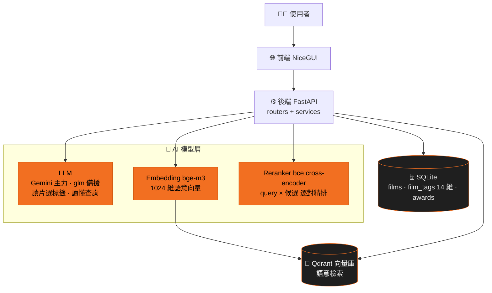
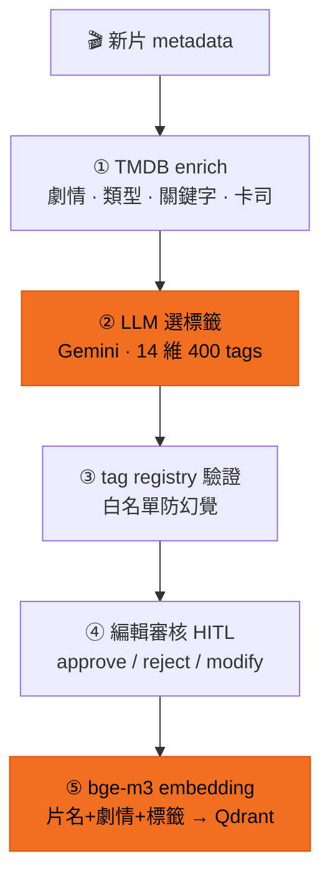
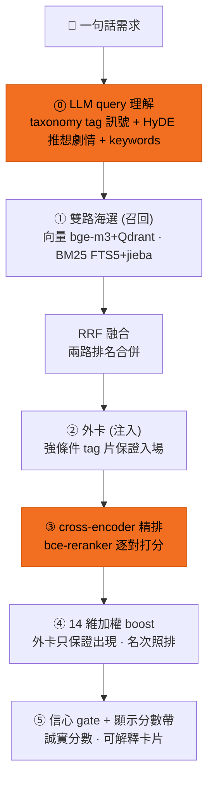
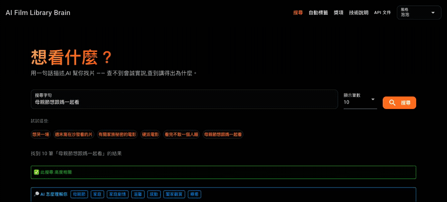
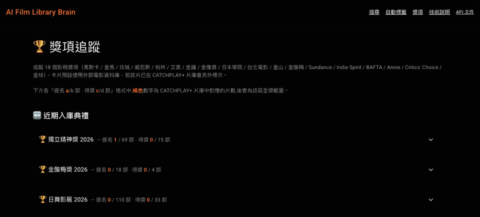

# AI 片庫大腦怎麼運作

```text
把五百多個固定分類改造成 14 維、400 個標籤的彈性體系,
讓編輯用一句話描述需求就能找片 —
AI 找不到時會誠實說,找到時講得出為什麼。
```

目前 prototype 規模:**667 部片、7,000+ 筆 AI 標籤、3,000+ 筆獎項紀錄(18 個獎項)**。

## 0. 全貌



---

## 1. 自動標籤(auto-tag)— 新片進庫時發生什麼



| 步驟 | 說明 | 技術 |
|---|---|---|
| ① 收集資料 | 把片名、劇情簡介湊齊,缺的去外部電影資料庫補 | TMDB API enrich |
| ② AI 讀片選標籤 | AI 讀完整部片的資料,從 14 維、400 個標籤裡挑出適合的 | Gemini(限流時自動換備援模型) |
| ③ 防幻覺驗證 | AI 只能用清單裡**存在**的標籤 — 自己發明的一律丟掉 | tag registry 白名單驗證 |
| ④ 編輯把關 | 編輯逐一核可 / 退回 / 修改,AI 負責領航、人負責品味 | Human-in-the-loop 審核紀錄 |
| ⑤ 變成語意向量 | 整部片(片名+劇情+標籤)濃縮成一個「語意座標」,供搜尋比對 | bge-m3 embedding → Qdrant 向量庫 |

退回的標籤不會消失 — 會進 **feedback wiki**,AI 定期整理「哪些標籤常被退、為什麼」,
變成下一輪改進的依據。

---

## 2. 語意搜尋(query)— 編輯輸入一句話之後



流程像選秀:

| 步驟 | 說明 | 技術 |
|---|---|---|
| ⓪ 讀懂需求 | AI 先理解你這句話:抓出條件(地區/得獎/情緒…)、想像「最符合的電影長什麼樣」 | LLM query 理解:taxonomy tag 訊號 + HyDE 推想劇情 + 關鍵字 |
| ① 海選 | 兩路大範圍撈候選:**語意**(意思相近)+ **字面**(字句命中) | 向量召回(bge-m3+Qdrant)+ BM25(FTS5+jieba) |
| ② 外卡 | 沒被海選撈到、但符合強條件(地區/得獎…)的片獲邀入場,保證出現 | 強條件 tag 注入候選池 |
| ③ 評審精排 | 模型把每部候選跟你的查詢逐一比對打分,重新排序 | cross-encoder(bce-reranker) |
| ④ 條件加分 | 帶到你指定條件的片往前排;**外卡只保證出現,名次照排** | 14 維加權 boost(無硬篩,永不空結果) |
| ⑤ 誠實分數 | 片庫沒真命中 → 亮警示「無高度相關結果」、分數壓低;有命中最高 95%,**永遠沒有假滿分** | 信心 gate(向量相似度門檻)+ 顯示分數帶 |

每張結果卡都講得出「為什麼是它」:`符合 [音樂][美式] · 語意+推想+字面`
(對上哪些條件 + 怎麼找到的)。

---

## 3. 信任機制 — 不只會找,還誠實可解釋

- **防幻覺**:AI 標籤一律過白名單驗證,不存在的標籤進不了庫。
- **誠實分數**:查不到就說查不到,但仍給出 AI 推測的相近結果讓編輯延伸發想。
- **可解釋**:每個結果標明符合條件與找到方式,不是黑盒子。
- **持續評測**:內部 45 條真實查詢的自動評測(LLM judge),前五名命中品質
  nDCG@5 ≈ 0.92–0.96,每次調整都跑分驗證,不憑感覺。
- **人在迴圈**:編輯審核 + feedback wiki,AI 領航、人把關。

---

## 4. 技術棧速查

| 角色 | 工具 | 說明 |
|---|---|---|
| 標籤 AI | Gemini(+OpenRouter 備援) | 讀片選標籤、讀懂查詢 |
| 語意理解 | BAAI/bge-m3 | 把片和查詢變成可比對的「語意座標」 |
| 精排 AI | maidalun1020/bce-reranker-base_v1 | 逐一比對查詢與候選,精細排序(中文域訓練) |
| 字面檢索 | SQLite FTS5 + jieba | 中文斷詞後的關鍵字搜尋,救專有名詞 |
| 向量庫 | Qdrant | 存語意座標,毫秒級找鄰居 |
| 資料庫 | SQLite | 片、標籤、獎項的權威來源 |
| 獎項資料 | award-tracker + Wikidata 驗證 | 抓官網提名清單 → AI 結構化 → 對庫上標籤 |
| 部署 | Docker Compose + Traefik | 一台 VPS 跑全套 demo |

---

## 5. Demo

### 搜尋



「母親節想跟媽一起看」→ 結果卡標明符合條件與找到方式;
換搜「Michael Jackson」→ 片庫無真命中,誠實警示 + 推測結果。

### 自動標籤


新片預覽「奧本海默」:TMDB 自動補資料 → AI 建議 11 個標籤(試跑,不寫入資料庫)。

### 獎項



18 個獎項典禮入庫 → 展開奧斯卡 2026:提名 / 得獎名單與 CATCHPLAY+ 片庫自動比對。
