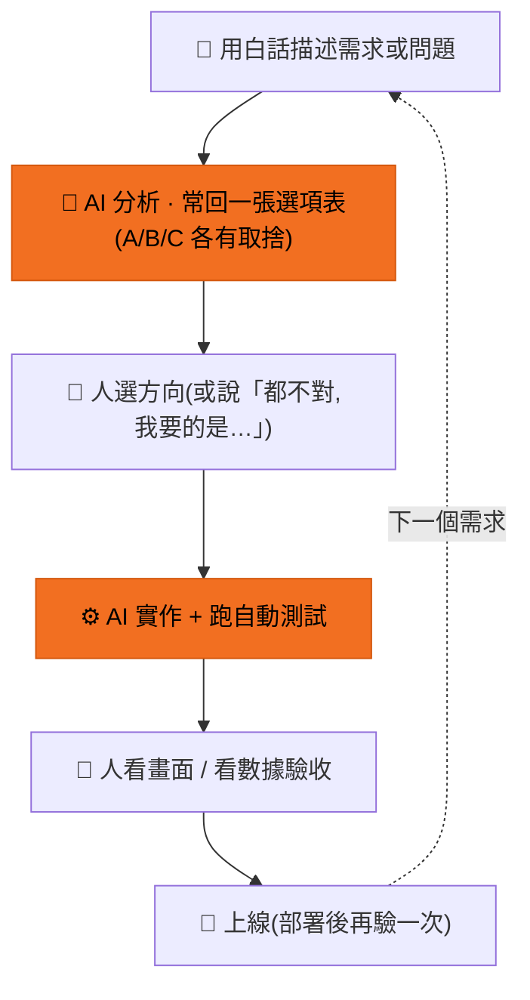

# 我們怎麼跟 AI 一起做出這個產品

*本文寫給團隊的非技術夥伴,說明工程端怎麼與 AI 協作。*

> 這份指南回答兩個問題:工程端「一人 + AI」實際上怎麼運作?
> 以及 — 你不寫程式,也能把同一套方法用在自己的工作上嗎?(可以,見第 6 節)

---

## 1. 一天的開發循環長什麼樣

每個功能、每個修正,都走同一個圈:

**真實案例走一圈** — 搜尋結果分數擠成一團那次:

1. 人(貼截圖):「分數都太近(65/65/62/60/59…),看不出差別。有沒有辦法拉開?」
2. AI 回三個方案:① 按真實差距重新攤開 ② 純等差排列 ③ 改用等級標籤不顯示數字 — 各附優缺點
3. 人:「用 ①」
4. AI 改完、測試通過、部署
5. 人 reload 畫面確認:分數從擠成一團變成 65 → 30 的清楚梯度 ✓

整圈不到一小時。關鍵不是 AI 寫得快,是**每一步都有人的判斷在裡面**。

---

## 2. 人在做什麼?(不是按 Enter 而已)

AI 負責產出,人負責五件事:

**① 選方向** — AI 善於列選項,不善於替你決定要什麼。
介面該往哪裡導、功能要做到多深,這類問題 AI 會給分析,但拍板的是人。

**② 給品味** — 產品的「對味」只有人知道。
例:首頁的示範查詢句要選哪幾句?人給的標準是「戲劇張力為主、適用面愈廣愈好」——
這種判斷 AI 給不出來,但給了標準之後,AI 可以快速產出一批讓人挑。

**③ 抓錯** — AI 給的永遠是「能跑的解法」,人守的是「對的原則」。
例:AI 曾判斷海報壞圖應該全面改抓外部資料庫;人指出真正原因是頁面延遲載入,
並重申資料原則「官方來源優先、外部補位」。AI 修正後問題消失。
另一例:AI 寫的對外文件裡,有些「當初為什麼這樣選」是它自己合理化補的 ——
人看出來、要求逐條對帳,把推測換成真實理由。**對 AI 的輸出保持「這是真的嗎?」的習慣,是協作裡最重要的肌肉。**

**④ 踩煞車** — 不是每個提案都該直接做。
重要改動先要求「寫成計畫/草稿,討論完再動手」;文件要對外發布前,先列「即將公開的內容清單」逐項確認。
AI 動作很快,煞車踏板在人腳下。

**⑤ 驗收** — 用看得懂的方式驗,不用看程式。
貼一張截圖問「這裡怪怪的?」、開 demo 網址實際操作、看評測分數有沒有變好。
驗收的語言是畫面和數據,不是程式碼。

---

## 3. 為什麼不會亂掉 — 護欄

把 AI 想成**動作很快、但會很有自信地犯錯的新人**。新人需要 code review,AI 也是 —— 只是我們把 review 盡量自動化:

| 護欄 | 白話 |
|---|---|
| 自動測試 | 每次改動跑 175 個檢查,壞了擋下來 |
| 提交關卡 | 程式碼進版本庫前自動掃:格式、密鑰外洩、甚至「介面文案不准寫死」 |
| 評分閉環 | 搜尋品質有客觀分數,每輪改動跑分 —— 贏的留、輸的回滾,不憑感覺 |
| 決策紀錄 | 重要技術轉向都寫下「背景、選項、理由」,AI 之後不會亂動既有決策 |
| 部署紀律 | 一律走版本庫部署,出事可以一鍵回滾、查得到是哪次改動 |

人不需要看懂每一行程式 —— 但這些護欄確保「沒人看的那些行」也有東西在把關。

---

## 4. 難題怎麼一起拆

第 5 節講的是「拿到新需求怎麼拆」;這一節相反 —— **卡住、AI 一直繞圈時**怎麼辦。
這種時候 AI 很會「看起來很努力地亂試」,而**人的提問品質決定出口**。
有一套順序可以照走:

**① 先停手,別讓它一直試**
連續幾輪沒進展,代表方向錯了,再試十次也一樣 —— 還會把問題愈攪愈亂。先喊停,回到診斷。

**② 要它先重現、再縮範圍**
「這個問題每次都會發生,還是偶爾?」「拿掉一半,還在不在?」
沒有穩定重現、沒有縮小範圍之前,所有的修都只是猜。

**③ 逼它講假設,而且假設要能被推翻**
「你覺得是什麼造成的?如果是,我們要怎麼驗證?」
講不出可以驗證的假設 = 還在亂槍打鳥,不要讓它動手改。

**④ 用二分法切因果**
這是當時的轉機。評測接本地 AI 服務連續不穩,AI 的修法一直繞圈,直到換成這個問法:

> 「先分清楚:是累積吃了三碗飯才飽,還是第三碗飯本身有問題?」

一刀把問題切兩半 —— 是「累積狀態」造成的,還是「特定輸入」造成的?
範圍砍半,方向立刻清楚。

**⑤ 一次只改一個地方,改完馬上驗**
同時改三處,就算好了也不知道是哪個的功勞、哪個其實沒用。一次一變因,因果才乾淨。

**⑥ 還是卡住,就換層次問**
別在同一層鑽牛角尖。兩個最有效的跳脫:
- **給參照**:「成熟的開源工具是怎麼解同一件事的?」比「你再想想」有效十倍 —— 借鑑勝過硬想。
- **退一步**:「我們是不是問錯問題了?」有時卡住是因為題目本身設錯。

**⑦ 把誤判寫下來**
每次「以為是 A 結果是 B」都照實記進決策紀錄 —— 否則 AI(跟人)過幾天會繞回同一個坑。

> 一句話總結:**卡住時,不是更用力,是更會問。** 停手 → 重現縮範圍 → 可證偽假設 →
> 二分切因果 → 一次一變因 → 換層次借參照 → 記錄誤判。

---

## 5. 拿到一個大需求,怎麼拆給 AI

「幫我做一個搜尋功能」這種需求,直接丟給 AI 會得到一坨能跑但你看不懂、改不動的東西。
先自己拆過一輪,再交手,品質天差地遠。拆解四步:

**① 先講清楚「做完長什麼樣」**
不是「做搜尋」,而是「使用者打一句話 → 看到一排相關的片卡 → 每張有分數」。
能描述出「驗收時我會看到什麼」,需求才算想清楚。

**② 拆成可以「一個一個驗」的小塊**
搜尋 = (a) 把片變成可比對的資料 →(b) 把查詢比對出候選 →(c) 排序 →(d) 畫面呈現。
每一塊都能單獨做、單獨確認對不對。一次只推一塊,壞了馬上知道是哪塊。

**③ 標出哪裡你有意見、哪裡放手**
「排序邏輯我要管(這是產品核心)、畫面用框架預設就好(不是重點)」。
把你的判斷力花在真正重要的塊上,其餘讓 AI 自己決定 — 不必每行都管。

**④ 先做最小、能驗證的那一塊**
不要一次要四塊。先做「能打一句話、回幾個結果」最小版,看到動了,再往上加。
看得到的進度比完美的計畫安全。

> 心法:**你拆得多細,AI 就做得多準。** 含糊的大需求 → 含糊的大產出;
> 清楚的小塊 → 每塊都驗得過。這跟你帶一個很快但需要明確指示的新人,完全一樣。

---

## 6. 你也可以照做 — 對 AI 下需求的五個心法

這套不只適用寫程式,用任何 AI 工具都成立:

**① 具體勝過抽象**
✗ 「搜尋怪怪的」
✓ 「搜『Michael Jackson』時第一名是一部戰爭片還標 100%,我預期它誠實說查不到」

**② 一次一件事**
一則訊息一個主題。五個需求擠一則,AI 會全做但每個都打八折 ——
我們真實的教訓:四個改進一起上,整體變差還查不出誰的鍋;拆開一個一個來,才找到真正有效的那個。

**③ 給範例與反例**
「標籤要像『紓壓』『虐戀』這種,不要『高共鳴策展』這種」—— 一組對照例勝過三段描述。

**④ 敢說「不對,我要的是…」**
AI 不會因為被打槍而變笨,只會因為你客氣而一直錯下去。
方向錯就直接打斷,愈早愈省。

**⑤ 重要的事,先要草稿**
「先給我 draft,我們討論完再執行」—— 對外的訊息、要發布的文件、大的改動,都先看再放行。
這份指南本身,就是這樣來回三輪才定稿的。

---

*本指南內容取材自專案實際開發過程(2026-05 ~ 06),所有案例皆真實發生。*
