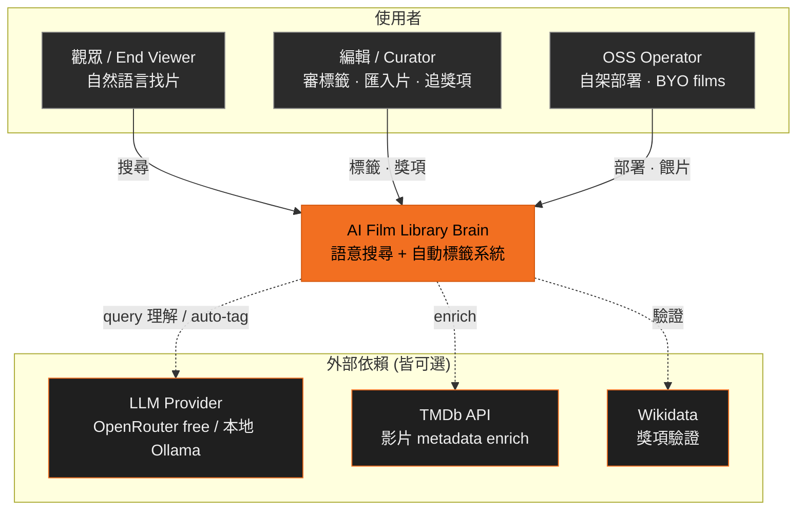
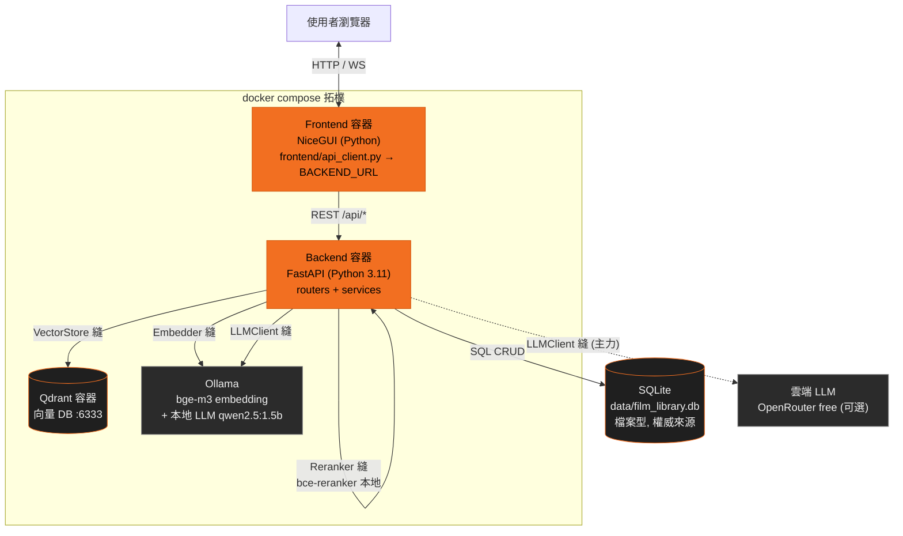

# 系統架構文件 — AI Film Library Brain

CATCHPLAY+ Hackathon 的開源原型:電影語意搜尋 + 自動標籤系統。本目錄是詳細架構文件集(取代過於簡化的 `../architecture.md`),用 C4 模型 + Mermaid 圖描述執行期結構、元件、資料流與部署。

## 導覽

| 文件                                     | 內容                                                                               |
| ---------------------------------------- | ---------------------------------------------------------------------------------- |
| **README.md**(本檔)                      | C4 L1 系統情境 + C4 L2 容器圖 + 技術棧表 + 功能↔模組表                             |
| [components.md](components.md)           | C4 L3 元件圖(router→service→store 呼叫鏈)+ Protocol 邊界的 class diagram(依賴反轉) |
| [search-pipeline.md](search-pipeline.md) | Hybrid 搜尋管線 flowchart + `POST /api/search` 跨模組 sequence + 信心分級 state    |
| [sequences.md](sequences.md)             | auto-tag / seed_from_file / record_nomination 三個 sequence + 標籤斷路器 state     |
| [data-model.md](data-model.md)           | 6 張資料表 erDiagram + 「SQLite 權威、Qdrant 只存向量」說明                        |
| [deployment.md](deployment.md)           | docker compose + Ollama + GHCR + Pages 部署 flowchart + keyless 降級層             |

設計取捨記錄在 [`../adr/`](../adr/)(ADR 0001–0021)。文中引用 ADR 編號處皆對應該目錄的檔案。

______________________________________________________________________

## C4 L1 — 系統情境 (System Context)

誰用這個系統、它依賴哪些外部服務。外部依賴**全部可選**:只用本地模型即可離線運作,LLM API key 非必須。

- **Keyless-capable**:只接本地模型(Ollama bge-m3 embedding + qwen2.5:1.5b、本地 cross-encoder)就能跑完整搜尋;雲端 LLM key 缺席時,query 理解與 auto-tag graceful degrade(見 [search-pipeline.md](search-pipeline.md) 與 [deployment.md](deployment.md))。

______________________________________________________________________

## C4 L2 — 容器圖 (Container)

執行期的可部署單元與它們之間的協定。標出四個 Protocol 邊界縫(ADR 0021 依賴反轉):消費端只依賴 Protocol,具體 impl 由 provider 注入。

四個 Protocol 邊界縫(`backend/interfaces.py`):`Embedder` · `VectorStore` · `Reranker` · `LLMClient`。impl 分別是 `EmbedService` · `QdrantVectorStore` · `CrossEncoderReranker` · `DefaultLLMClient`,透過 provider 解析(`get_embed_service` / `get_vector_store` / `get_reranker` / `get_llm_client`),測試時注入 fake。詳見 [components.md](components.md)。

______________________________________________________________________

## 技術棧 (Tech Stack)

| 層            | 工具                              | 備註                                                                   |
| ------------- | --------------------------------- | ---------------------------------------------------------------------- |
| Frontend      | NiceGUI                           | Python WebSocket UI;`frontend/api_client.py` 經 `BACKEND_URL` 呼叫後端 |
| Backend       | FastAPI + Pydantic                | Python 3.11;routers + services                                         |
| Relational DB | SQLite                            | 檔案型,權威來源(films / film_tags / award_nominees …)                  |
| Vector DB     | Qdrant                            | Docker,port 6333;只存向量 + tag-id payload                             |
| Embedding     | BAAI/bge-m3                       | 1024 dims;本地經 Ollama 或 sentence-transformers                       |
| Lexical 檢索  | SQLite FTS5 + jieba               | BM25,中文先斷詞,補向量抓不到的字面 / 專有名詞                          |
| Reranker      | maidalun1020/bce-reranker-base_v1 | 本地 cross-encoder;CPU 慢 → gated                                      |
| LLM(主力)     | OpenRouter free tier              | query 理解 / auto-tag;可選                                             |
| LLM(fallback) | 本地 Ollama qwen2.5:1.5b          | 雲端限流 / 無 key 時接手;兩者皆掛 → graceful degrade                   |
| External API  | TMDb / Wikidata                   | enrich / 獎項驗證,皆可選                                               |
| Container     | Docker Compose                    | backend / frontend / qdrant + Ollama;規劃 GHCR 預建 image              |
| Docs site     | GitHub Pages                      | portfolio / 文件站                                                     |

______________________________________________________________________

## 功能 ↔ 模組對應 (Feature ↔ Module)

> `backend/services/*.py` 是後端架構層,由 router 在 runtime 呼叫。

| 功能              | Router                | Service / Module                                                                                          |
| ----------------- | --------------------- | --------------------------------------------------------------------------------------------------------- |
| 語意搜尋 / 相似片 | `routers/search.py`   | `services/hybrid.py` · `fusion.py` · `bm25_search.py` · `query_expand.py` · `reranker.py` · `embedder.py` |
| 新片自動標籤      | `routers/auto_tag.py` | `services/auto_tag.py` + `llm_client.py`                                                                  |
| 獎項追蹤          | `routers/awards.py`   | `award_manager.py` + `film_matcher.py` + `tmdb_lookup.py`                                                 |
| 標籤回饋          | `routers/feedback.py` | `services/feedback.py` + `feedback_store.py`                                                              |
| Tag 審核          | `routers/reviews.py`  | `db.py`(tag_reviews)                                                                                      |
| 影片 CRUD         | `routers/films.py`    | `db.py`                                                                                                   |
| 14 維 taxonomy    | `routers/tags.py`     | `tag_registry.py`(`data/dimension-mapping.json`)                                                          |
| Vector store      | —                     | `vector_store.py`(Qdrant)                                                                                 |
| 評測              | —                     | `services/eval_judge.py`                                                                                  |
| 熱載旋鈕          | —                     | `services/search_config.py`                                                                               |

詳細呼叫鏈見 [components.md](components.md)。
