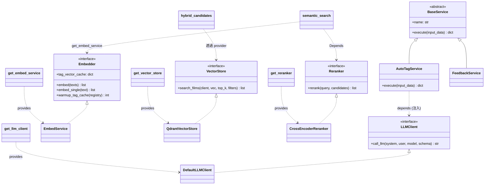

# 元件與類別 — C4 L3

← 回 [README](README.md) · 相關:[search-pipeline](search-pipeline.md) · [sequences](sequences.md)

## C4 L3 — 元件圖 (Component)

`routers/` → `services/` → `db.py` / `vector_store.py` / `tag_registry.py` 的呼叫鏈。所有 router 掛在 `/api` 之下(`backend/main.py`)。

```mermaid
flowchart TB
    subgraph Routers["routers/ (FastAPI, /api)"]
        R_S["search.py<br/>semantic_search · similar"]
        R_AT["auto_tag.py"]
        R_AW["awards.py"]
        R_FB["feedback.py"]
        R_FM["films.py"]
        R_RV["reviews.py"]
        R_TG["tags.py"]
    end

    subgraph Services["services/ (BaseService 層)"]
        S_HY["hybrid.py<br/>hybrid_candidates"]
        S_FU["fusion.py<br/>RRF rrf_fuse"]
        S_BM["bm25_search.py<br/>FTS5 + jieba"]
        S_QE["query_expand.py<br/>expand_query (cached)"]
        S_RR["reranker.py<br/>CrossEncoderReranker"]
        S_EM["embedder.py<br/>EmbedService"]
        S_ATS["auto_tag.py<br/>AutoTagService"]
        S_FBS["feedback.py<br/>FeedbackService"]
        S_CFG["search_config.py<br/>熱載旋鈕"]
    end

    subgraph Core["核心模組"]
        DB["db.py<br/>SQLite + CRUD"]
        VS["vector_store.py<br/>QdrantVectorStore"]
        TR["tag_registry.py<br/>14 維 / 395 tag"]
        LLM["llm_client.py<br/>DefaultLLMClient + 斷路器"]
        AM["award_manager.py"]
        FM["film_matcher.py"]
        TM["tmdb_lookup.py"]
        FS["feedback_store.py"]
    end

    R_S --> S_QE
    R_S --> S_EM
    R_S --> S_HY
    R_S --> S_RR
    R_S --> S_CFG
    R_S --> DB
    S_HY --> S_BM
    S_HY --> VS
    S_HY --> S_FU
    S_QE --> LLM
    S_EM --> TR

    R_AT --> S_ATS
    S_ATS --> LLM
    S_ATS --> TR

    R_AW --> AM
    AM --> FM
    AM --> TM
    AM --> TR
    AM --> DB

    R_FB --> S_FBS
    S_FBS --> FS
    R_RV --> DB
    R_FM --> DB
    R_TG --> TR

    classDef r fill:#f26f21,stroke:#d4570c,color:#000
    classDef s fill:#2b2b2b,stroke:#888,color:#efefef
    classDef c fill:#1f1f1f,stroke:#f26f21,color:#efefef
    class R_S,R_AT,R_AW,R_FB,R_FM,R_RV,R_TG r
    class S_HY,S_FU,S_BM,S_QE,S_RR,S_EM,S_ATS,S_FBS,S_CFG s
    class DB,VS,TR,LLM,AM,FM,TM,FS c
```

______________________________________________________________________

## 類別圖 — Protocol 邊界 + 依賴反轉 (ADR 0021)

四個 heavy/外部依賴各有一個結構化、runtime-checkable 的 `Protocol`(`backend/interfaces.py`)。消費端只依賴 Protocol;具體 impl 由 provider 解析並注入(default 參數 / FastAPI `Depends` / constructor),測試傳 fake 而非 monkeypatch 模組名。

- **縫的好處**:`semantic_search` 收 `Reranker = Depends(get_reranker)`;`AutoTagService(llm_client=...)` 預設取 process-wide client,測試傳 fake。consumer 不知道 impl 是 Qdrant 還是 in-memory、是 OpenRouter 還是本地 Ollama。
- `EmbedService` 持有 `tag_vector_cache`:warmup 後存每個 tag 的向量,搜尋路徑用它對 query 算 tag 相關度,不必重嵌入。
