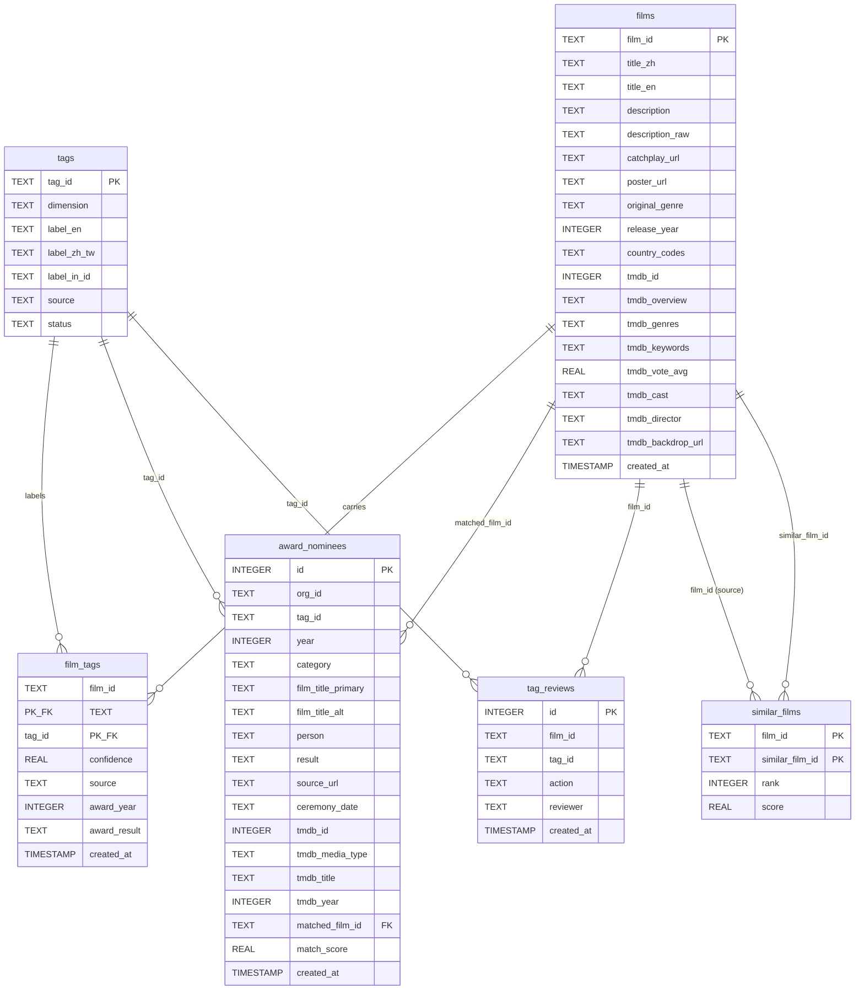

# 資料模型 — Data Model

← 回 [README](README.md) · 相關:[sequences](sequences.md)

schema 權威定義在 `backend/db.py` 的 `SCHEMA`。下圖列 6 張表的關鍵欄位與關係。

## 關係說明

- **`films` 1—\* `film_tags` \*—1 `tags`**:多對多影片↔標籤,join 表 `film_tags` 帶 `confidence` / `source`,複合主鍵 `(film_id, tag_id)`。`source` 區分標籤來源(migrated / LLM / award curation …);獎項回寫的列另帶 `award_year` / `award_result`。
- **`films` 1—\* `award_nominees`**:nominee 經 `matched_film_id`(模糊比對 ≥ `MATCH_THRESHOLD`)關聯到片庫的片。nominee 列獨立存在 — 片不在庫也保留(刪片時 `matched_film_id` 被清為 NULL,nominee 不刪)。`tag_id` 指向 per-ceremony 的獎項 tag。`UNIQUE (tag_id, year, film_title_primary, person)` 做去重。
- **`films` 1—\* `tag_reviews`**:人工逐 tag 審核紀錄(`action` = approved / rejected / modified)。`reject_rate` 統計餵 feedback wiki。
- **`films` 1—\* `similar_films`**:離線預算的相似片(`scripts/05_compute_similar.py`,跑完整 BM25+vector→RRF→CE 管線),`(film_id, similar_film_id)` 複合主鍵 + `rank` / `score`,讓詳情頁變查表、免付請求時 cross-encoder 成本。
- **`films_fts`**(未畫於 ER):FTS5 虛擬表,`bm25_search.rebuild_fts()` 從 `films` 重建,內容經 jieba 斷詞(space-join)讓 unicode61 tokenizer 看得到中文詞。

## SQLite 權威、Qdrant 只存向量

**SQLite 是唯一權威來源(source of truth)** — 所有結構化資料(影片、標籤、獎項、審核、相似片)都在 `data/film_library.db`。

**Qdrant 只存向量 + 一份 tag-id payload 供過濾**:`vector_store.build_film_payload` 把片向量與一組 tag id 寫進 Qdrant,供向量召回與維度過濾用。**展示資料一律回讀 SQLite**(例:poster 取自 SQL,不取 Qdrant payload — 舊 payload 可能帶 `data:` placeholder)。兩者若不一致,以 SQLite 為準;Qdrant 可由 embedding 流程從 SQLite 重建。
