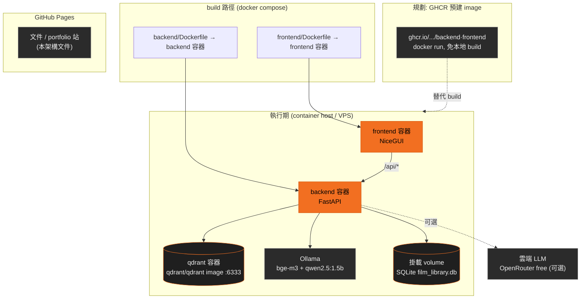
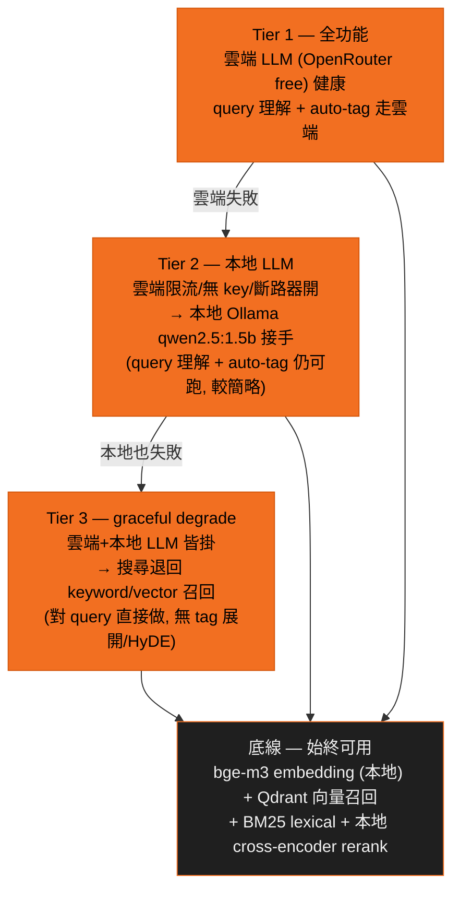

# 部署 — Deployment

← 回 [README](README.md) · 相關:[search-pipeline](search-pipeline.md)(降級行為) · [sequences](sequences.md)(斷路器)

## 部署拓樸

`docker-compose.yml` 起 backend(build `backend/Dockerfile`)、frontend(build `frontend/Dockerfile`)、qdrant(pull `qdrant/qdrant` image)。Ollama 提供 embedding + 本地 LLM。SQLite 為掛載的檔案 DB。規劃:GHCR 預建 image 走 `docker run`(免本地 build);文件 / portfolio 站部署到 GitHub Pages。

## 啟動行為 — serve healthy first (ADR 0012)

backend `lifespan` 只同步跑必要步驟(`init_db`);所有 heavy warmup —— tag-vector cache(`get_embed_service().warmup_tag_cache`)、BM25 FTS 重建、cross-encoder load、demo chips —— 都丟背景 thread。慢 / 卡住的 warmup 不再阻塞啟動(曾是 502 來源);第一個需要未暖元件的請求 lazy load 它。

## Keyless / runtime-LLM 降級層

系統 keyless-capable:只接本地模型即可跑完整搜尋,雲端 LLM key 非必須。

- 搜尋的召回 / 排序(embedding + Qdrant + BM25 + 本地 reranker)**完全不靠雲端 LLM** —— LLM 只負責 query 理解的 tag 展開與 HyDE,缺席時搜尋仍運作,只是少了語意展開的 boost。
- auto-tag 的雲端→本地切換由斷路器處理([sequences](sequences.md))。
