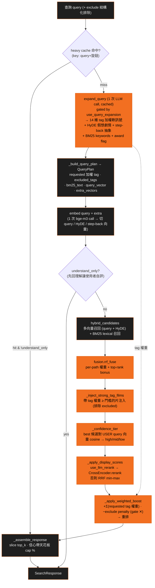
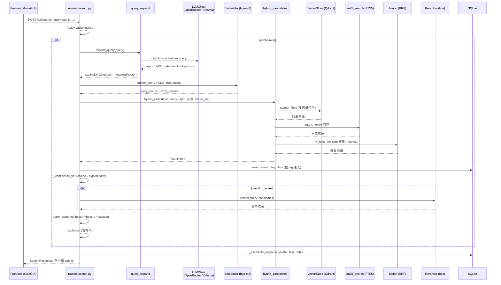
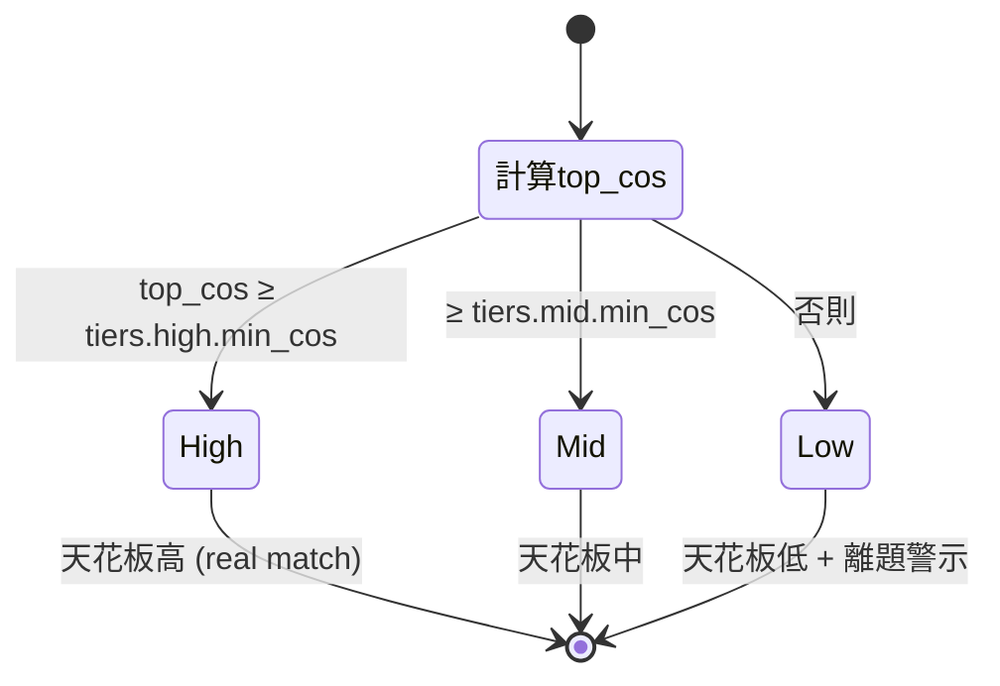

# 搜尋管線 — Hybrid Pipeline

← 回 [README](README.md) · 相關:[components](components.md) · ADR [0001](../adr/0001-hybrid-search-qmd.md) / [0002](../adr/0002-llm-query-understanding.md) / [0009](../adr/0009-confidence-tiers-and-honest-scoring.md)

`backend/routers/search.py` 的 `semantic_search` 與其 helper(`_build_query_plan` · `_apply_query_expansion` · `_inject_strong_tag_films` · `_apply_display_scores` · `_apply_weighted_boost` · `_confidence_tier` · `_assemble_response`)組成混合召回 + 重排管線。query 理解只有一條路徑(LLM),手刻 regex parser 已折入 LLM(ADR 0018)。

## 管線 flowchart

- **LLM query 理解**(ADR 0002):一次 call,per-query cached,`use_query_expansion` 控。產出 14 維 taxonomy tag(加權軟 boost 訊號)、HyDE 假想劇情文字、step-back 抽象文字(只用於模糊 query)、BM25 keywords。LLM 失敗 → degrade 成對 `req.query` 直接做 keyword/vector 召回(不再有手刻 parser)。
- **多向量召回**:`VectorStore.search_films` 對 query 向量 + HyDE 向量分別召回;`bm25_search` 做字面召回;全部經 `fusion.rrf_fuse`(per-path 權重 + top-rank bonus)融合。
- **強條件注入**:帶 requested tag 且權重 ≥ 門檻的片被注入,讓高訊號 intent(地區 / 得獎)永遠有結果可排;注入片跳過使用者排除方向的片。
- **統一加權 boost**:片得 `scale × Σ(它帶的 requested tag 權重)`;排除方向(gate ✕)每命中一個 excluded tag 扣大 penalty,讓它掉到顯示門檻下 → 全排除的池誠實回空,不 crash。
- **heavy cache**:key 為 query + 旋鈕;只快取乾淨(非空且 LLM 未 degrade)結果。`understand_only` 不寫 cache。
- **相似片**:離線預算(`scripts/05_compute_similar.py`)寫入 `similar_films` 表;未預算的走即時 cosine fallback。

______________________________________________________________________

## sequence — 一次 `POST /api/search`

______________________________________________________________________

## 信心分級 (ADR 0009)

cosine 是**唯一能分辨真命中 / 離題的訊號**;cross-encoder 絕對分**只能排序、不能當真值**(對無關片也可能給高分)。所以信心帶 + 顯示天花板都 key 在「最佳候選對使用者原句向量的 cosine」,**不是** HyDE 向量(那個 by construction 偏高)。

- 帶內位置 = cross-encoder 排序(絕對值無意義),對**整個候選池**做 min-max(非顯示切片)→ 同片跨 `top_k` 分數穩定。
- 顯示帶天花板承載誠實訊號:第一名的 % 反映「片庫到底有沒有這片」,不再每查詢都頂分。
