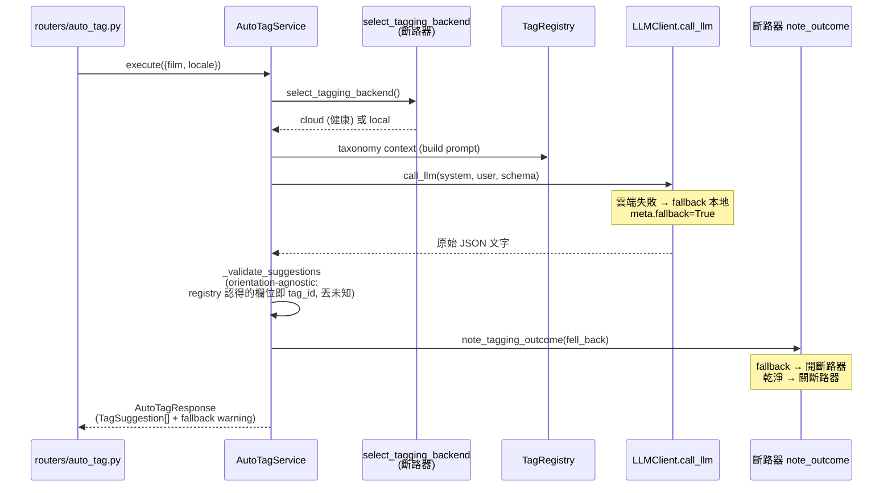
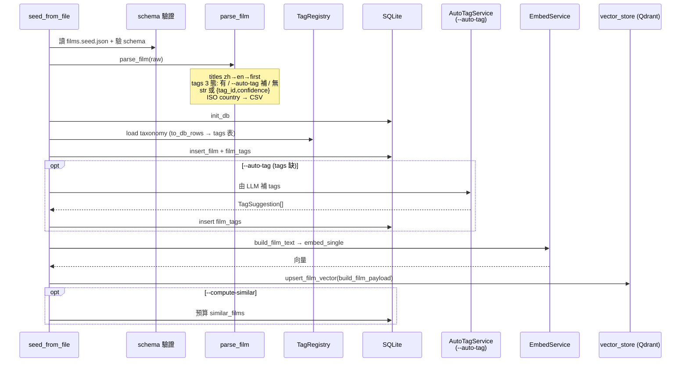
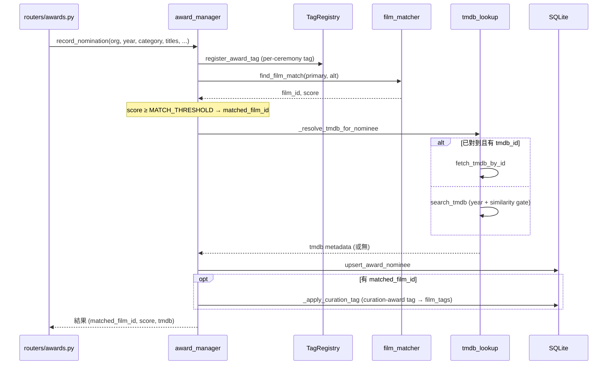
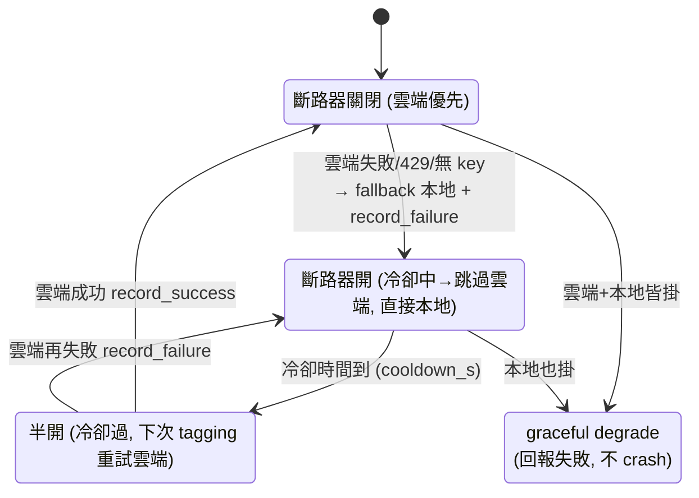

# 關鍵流程 sequence

← 回 [README](README.md) · 相關:[components](components.md) · [search-pipeline](search-pipeline.md)

涵蓋三條寫入 / 處理流程與標籤斷路器。

## (a) 自動標籤一部片 — auto-tag

`backend/services/auto_tag.py` `AutoTagService.execute`。雲端優先(ADR [0013](../adr/0013-cloud-preferred-tagging-circuit-breaker.md)),失敗 fallback 本地。

## (b) 餵片 — seed_from_file

`scripts/seed_from_file.py` — 公開的 bring-your-own-films 路徑。讀 `data/films.seed.json`(對 `films.seed.schema.json` 驗證)。CATCHPLAY scraper 是私有 source adapter,輸出同一格式(中性 adapter contract 見 `scripts/adapters/example_adapter.py`)。

## (c) 獎項 — record_nomination

`backend/award_manager.py` `record_nomination`。Wikidata 驗證另由 `scripts/validate_awards_wikidata.py` 跑。

______________________________________________________________________

## 標籤斷路器 — cloud-preferred (ADR 0013)

8GB CPU 機跑不動完整 taxonomy prompt,所以 auto-tag 優先雲端,用時間冷卻型斷路器:失敗後冷卻期內跳過雲端(不做 per-request retry 等待),冷卻過後半開重試,結果決定再開或關閉。無背景輪詢、不燒配額。

- `cloud_tagging_available()` = 有設 cloud backend + 有 key + 斷路器未開。
- `select_tagging_backend()` 據此回雲端或本地;`note_tagging_outcome(fell_back)` 餵回斷路器。
- keyless / 無雲端時 → 一律走本地,搜尋仍可用([deployment](deployment.md) 降級層)。
