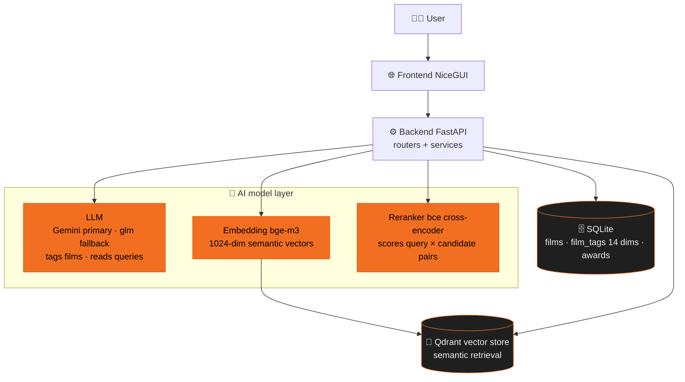
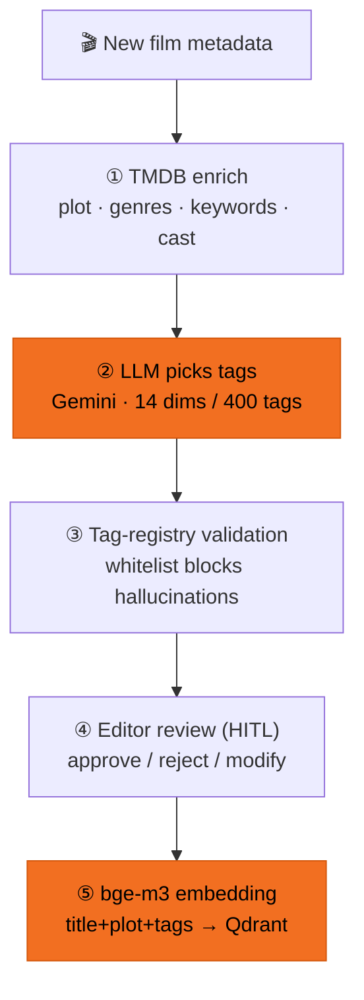
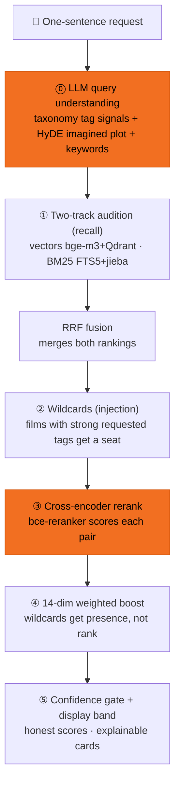

# How the AI Film-Library Brain Works

```text
Five-hundred-plus rigid genre nodes reshaped into a flexible
14-dimension / 400-tag taxonomy — editors find films by describing
what they want in one sentence. The AI says so honestly when nothing
truly matches, and explains itself when something does.
```

Current prototype scale: **667 films, 7,000+ AI tags, 3,000+ award records (18 award bodies)**.

## 0. The Big Picture



---

## 1. Auto-Tagging — what happens when a film enters the library



| Step | What happens | Tech |
|---|---|---|
| ① Gather data | Collect title and synopsis; fill gaps from an external movie database | TMDB API enrich |
| ② AI reads & picks tags | The AI reads everything about the film and picks fitting tags from the 14-dim / 400-tag taxonomy | Gemini (auto-fallback on rate limits) |
| ③ Anti-hallucination check | The AI may only use tags that **exist** — anything it invents is dropped | tag-registry whitelist validation |
| ④ Editor gate | Editors approve / reject / modify each tag — AI navigates, humans keep the taste | human-in-the-loop review records |
| ⑤ Become a semantic vector | The whole film (title + plot + tags) is condensed into one "semantic coordinate" for search | bge-m3 embedding → Qdrant |

Rejected tags don't vanish — they feed a **feedback wiki** where the AI periodically
digests which tags get rejected and why, fueling the next round of improvements.

---

## 2. Semantic Search — after the editor types one sentence



The flow works like a talent show:

| Step | What happens | Tech |
|---|---|---|
| ⓪ Understand the request | The AI parses your sentence: extracts conditions (region / awards / mood…) and imagines "what the perfect match would look like" | LLM query understanding: taxonomy signals + HyDE plot + keywords |
| ① Audition | Two wide-recall tracks: **semantic** (similar meaning) + **lexical** (matching words) | vector recall (bge-m3 + Qdrant) + BM25 (FTS5 + jieba) |
| ② Wildcards | Films that weren't recalled but carry a strong requested tag (region / awards…) are invited in, guaranteed to appear | strong-tag injection into the candidate pool |
| ③ Jury rerank | A model compares every candidate against your query, one pair at a time, and reorders | cross-encoder (bce-reranker) |
| ④ Condition boost | Films carrying your requested tags move up; **wildcards are guaranteed presence, never rank** | 14-dim weighted boost (no hard filters, never empties results) |
| ⑤ Honest scores | No real match in the library → a warning banner and lowered scores; with real matches the cap is 95% — **never a fake 100%** | confidence gate (vector-similarity threshold) + display band |

Every result card can explain itself: `matches [music][american] · semantic+imagined+lexical`
(which conditions it satisfies + how it was found).

---

## 3. Trust — it doesn't just find, it explains honestly

- **Anti-hallucination**: every AI tag passes whitelist validation; invented tags never enter the library.
- **Honest scores**: when nothing matches it says so — while still offering its best guesses as starting points.
- **Explainable**: every result states the matched conditions and the retrieval path. No black box.
- **Continuously measured**: an automated eval harness (LLM judge) over 45 real queries
  scores top-5 quality at nDCG@5 ≈ 0.92–0.96; every change is scored, nothing ships on vibes.
- **Humans in the loop**: editor review + feedback wiki — AI navigates, humans steer.

---

## 4. Tech Stack at a Glance

| Role | Tool | In one line |
|---|---|---|
| Tagging AI | Gemini (+OpenRouter fallback) | reads films, picks tags, parses queries |
| Semantic understanding | BAAI/bge-m3 | turns films and queries into comparable "semantic coordinates" |
| Precision reranker | maidalun1020/bce-reranker-base_v1 | scores query–candidate pairs (Chinese-domain trained) |
| Lexical search | SQLite FTS5 + jieba | keyword search over segmented Chinese, rescues proper nouns |
| Vector store | Qdrant | stores semantic coordinates, millisecond neighbor lookup |
| Database | SQLite | the source of truth for films, tags, awards |
| Awards data | award-tracker + Wikidata verification | official nominee lists → AI-structured → matched to the library |
| Deployment | Docker Compose + Traefik | the whole demo on one VPS |

---

## 5. Demo

### Search


"Something to watch with mom on Mother's Day" → result cards state matched conditions
and retrieval paths; switch to "Michael Jackson" → no true match in the library,
an honest warning plus best-guess results.

### Auto-tagging


New-film preview for "Oppenheimer": TMDB enrichment → the AI suggests 11 tags
(dry run, nothing written to the database).

### Awards


18 award ceremonies ingested → expanding Oscars 2026: nominees and winners
automatically matched against the CATCHPLAY+ library.
