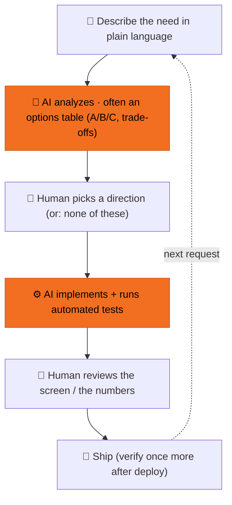

# How We Built This Product Together With AI

*Originally written for the non-technical members of the team, explaining how the engineering side collaborates with AI.*

> This guide answers two questions: how does "one engineer + AI" actually work?
> And — can you apply the same method to your own work without writing code?
> (Yes — see section 6.)

---

## 1. What a day's development loop looks like

Every feature and every fix goes through the same loop:

**A real loop, end to end** — the time the search scores all huddled together:

1. Human (pasting a screenshot): "The scores are too close (65/65/62/60/59…), you can't tell anything apart. Can we spread them?"
2. AI replies with three options: ① re-stretch by true gaps ② uniform spacing ③ replace numbers with level labels — each with trade-offs
3. Human: "Use ①"
4. AI implements, tests pass, deploys
5. Human reloads the page: the huddle becomes a clear 65 → 30 gradient ✓

The whole loop took under an hour. The point isn't that AI writes fast —
it's that **human judgment sits inside every step**.

---

## 2. So what does the human do? (Not just pressing Enter)

AI produces; the human owns five things:

**① Picking direction** — AI is great at listing options, bad at deciding what you want.
Where a page should lead, how deep a feature should go — AI offers analysis, humans make the call.

**② Supplying taste** — only humans know what "feels right" for the product.
Example: which sample queries belong on the home page? The human's bar was
"dramatic pull first, but the broader the appeal the better" — a judgment AI
can't originate, but once given the bar, AI drafts batches to choose from.

**③ Catching errors** — AI offers "solutions that run"; humans guard "principles that hold".
Example: AI once concluded broken posters meant switching wholesale to an external
image source; the human pointed out the real cause was lazy-loading on the page,
and restated the data principle "official source first, external as fallback". Fixed.
Another: in an outward-facing document, some of the "why we chose this" rationale
turned out to be AI's own plausible reconstruction — the human caught it and demanded
a line-by-line audit, replacing guesses with real reasons.
**Keeping the "is this actually true?" reflex is the most important muscle in the collaboration.**

**④ Braking** — not every proposal should be executed immediately.
Big changes start with "write the plan first, we discuss before you touch anything";
before anything goes public, the AI must list exactly what will be published, item by item.
AI moves fast; the brake pedal stays under the human's foot.

**⑤ Acceptance** — verify in languages you can read; no code required.
Paste a screenshot and ask "does this look off?", click through the demo URL,
watch whether the eval score moved. The acceptance language is screens and numbers, not code.

---

## 3. Why it doesn't descend into chaos — guardrails

Think of AI as **a very fast new hire who errs with great confidence**. New hires
need code review; so does AI — we just automate as much of the review as possible:

| Guardrail | Plainly |
|---|---|
| Automated tests | every change runs 175 checks; breakage gets blocked |
| Commit gates | before code enters the repo it's scanned: formatting, leaked secrets, even "no hardcoded UI copy" |
| Scored eval loop | search quality has an objective score; every change is measured — winners stay, losers roll back |
| Decision records | every major pivot is written down (context, options, reasons) so AI won't later bulldoze old decisions |
| Deploy discipline | everything ships through version control — one-click rollback, every change traceable |

Humans don't need to read every line of code — the guardrails make sure
the lines nobody reads are still being watched.

---

## 4. Cracking hard problems together

Not every problem yields on the first try. When things stall,
**the quality of the human's questions decides the way out**.

It really happened: the eval system kept failing against a local AI-model service,
round after round, with the AI's fixes circling. The turn came not from
"try again", but from changing the question:

> "First tell me: are you full because you ate three bowls of rice,
> or because something was wrong with the third bowl?"

One sentence pulled the AI from scattergun fixes back to causal triage —
is this an **accumulated-state** problem or a **specific-input** problem?
A second nudge followed: "go see how mature open-source tools talk to this
same service" — the AI dissected one, and found the real fix.

Three moves that work on hard problems:
- **Force causality**: use analogies and binary splits to make AI classify the problem before touching anything
- **Give references**: "how do others solve this?" beats "think harder" ten times over
- **Demand records**: every misdiagnosis goes into the decision record — next time, AI looks it up itself

---

## 5. Taking a big ask and breaking it down for AI

A request like "build me a search feature", handed straight to AI, gets you a
blob that runs but you can't read or change. Break it down yourself first, then
hand it over — the quality gap is enormous. Four steps:

**① Spell out "what done looks like" first**
Not "build search", but "the user types a sentence → sees a row of relevant film
cards → each with a score". If you can describe what you'll see at acceptance,
the need is actually thought through.

**② Split into pieces you can verify one at a time**
Search = (a) turn films into comparable data → (b) match the query to candidates →
(c) rank → (d) render. Each piece stands alone and can be checked on its own.
Ship one piece at a time; if it breaks, you know exactly which.

**③ Mark where you have an opinion and where you let go**
"I own the ranking logic (it's the product's core); the layout can use the
framework default (not the point)." Spend your judgment on the pieces that matter,
let AI decide the rest — you don't have to police every line.

**④ Do the smallest verifiable piece first**
Don't ask for four pieces at once. Build the minimal "type a sentence, get a few
results" version, watch it move, then add on. Visible progress beats a perfect plan.

> The principle: **the finer you slice, the more accurately AI builds.** A vague
> big ask → a vague big output; clear small pieces → every piece passes. Exactly
> like managing a fast new hire who needs precise instructions.

---

## 6. Do it yourself — five principles for briefing an AI

These aren't coding-specific; they hold for any AI tool:

**① Concrete beats abstract**
✗ "Search feels off"
✓ "Searching 'Michael Jackson' returns a war film at 100% — I expected it to honestly say there's no match"

**② One thing at a time**
One message, one topic. Cram five asks into one and the AI does all five at 80%.
Our real lesson: four improvements shipped together made things worse and untraceable;
unbundled one by one, the single change that mattered stood out.

**③ Give examples and counter-examples**
"Tags should feel like 'comfort watch' or 'toxic romance' — not like 'high-resonance curation'."
One contrast pair beats three paragraphs of description.

**④ Dare to say "no — what I want is…"**
AI doesn't get discouraged by pushback; it only keeps being wrong when you stay polite.
Interrupt early; it's cheaper.

**⑤ For anything important, ask for a draft first**
"Draft first, we discuss, then execute" — outbound messages, public documents,
big changes: review before release.
This guide itself went through three rounds of exactly that.

---

*Material drawn from the project's actual development (May–June 2026). All cases really happened.*
