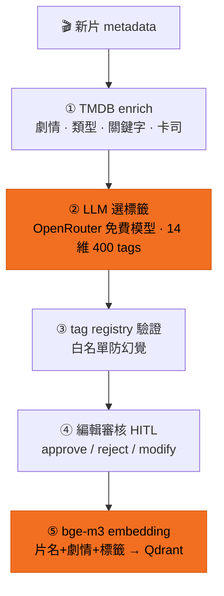

# 自動標籤 — 新片進庫時發生什麼

新片進來,AI 讀資料、從 14 維 400 個標籤裡選出貼切的,編輯把關後變成可搜尋的語意向量。

| 步驟 | 說明 | 技術 |
|---|---|---|
| ① 收集資料 | 把片名、劇情簡介湊齊,缺的去外部電影資料庫補 | TMDB API enrich |
| ② AI 讀片選標籤 | AI 讀完整部片的資料,從 14 維、400 個標籤裡挑出適合的 | OpenRouter 免費模型(會自動跳可用模型;亦可切回本地) |
| ③ 防幻覺驗證 | AI 只能用清單裡**存在**的標籤 — 自己發明的一律丟掉 | tag registry 白名單驗證 |
| ④ 編輯把關 | 編輯逐一核可 / 退回 / 修改,AI 負責領航、人負責品味 | Human-in-the-loop 審核紀錄 |
| ⑤ 變成語意向量 | 整部片(片名+劇情+標籤)濃縮成一個「語意座標」,供搜尋比對 | bge-m3 embedding → Qdrant 向量庫 |

任何一部片都能**隨時重新分析**(詳情頁 🔄)— 重跑一次 AI、進編輯模式重新挑選。
退回的標籤不會消失,會進回饋知識庫供 AI 後續整理(見[可解釋結果](/explainable))。
