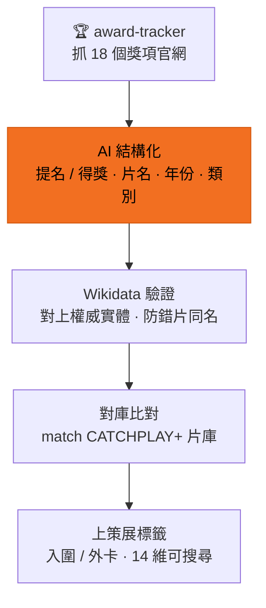

# 獎項追蹤

「奧斯卡今年提名哪些片?我們片庫有嗎?」這種問題本來要人工查官網、一部部比對。
這個原型把它自動化:抓官網提名清單 → AI 結構化 → 對庫上標籤 → Wikidata 驗證。
目前已入庫 **18 個獎項典禮、3,000+ 筆獎項紀錄**。

> ℹ️ 此頁展示完整系統跑在真實目錄的成果。**公開 repo** 出的是 ingest + 一個中性 source-adapter 範本(`scripts/adapters/`);獎項官網抓取本身是私有 adapter。

## 流程

| 步驟 | 說明 | 技術 |
|---|---|---|
| ① 抓清單 | 從 18 個獎項官網抓提名 / 得獎名單 | award-tracker |
| ② AI 結構化 | 把雜亂的網頁文字整理成片名 / 年份 / 類別 / 提名或得獎 | LLM |
| ③ 權威驗證 | 對上 Wikidata 實體,避免同名片掛錯獎 | Wikidata 比對 |
| ④ 對庫比對 | 名單對 CATCHPLAY+ 片庫,標出「我們有哪些」 | 片庫 match |
| ⑤ 上策展標籤 | 得獎資訊變成可搜尋的策展標籤(入圍 / 外卡) | 14 維 taxonomy |

獎項變成標籤後,就能跟其他維度一起搜 — 「得過獎的韓國犯罪片」這種查詢直接命中。
搜尋裡「外卡」怎麼保證入場 → [語意搜尋](/query)。

## Demo

18 個獎項典禮入庫 → 展開奧斯卡 2026:提名 / 得獎名單與 CATCHPLAY+ 片庫自動比對。
