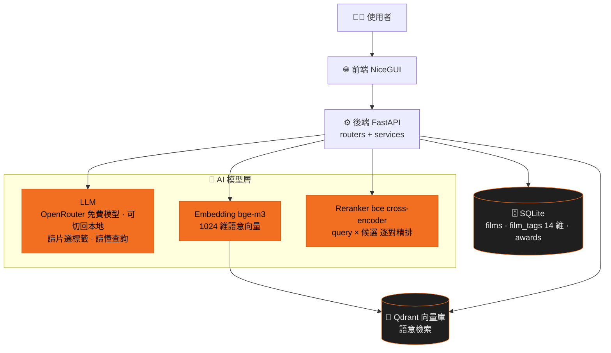

# AI 片庫大腦怎麼運作

```text
把五百多個固定分類改造成 14 維、400 個標籤的彈性體系,
讓編輯用一句話描述需求就能找片 —
AI 找不到時會誠實說,找到時講得出為什麼。
```

目前 prototype 規模:**600+ 部片、7,000+ 筆 AI 標籤、3,000+ 筆獎項紀錄(18 個獎項)**。

深入看兩條主管線:[自動標籤](/auto-tag)(新片進庫)與[語意搜尋](/query)(編輯找片);信任面見[可解釋結果](/explainable)與[誠實匹配](/honest)。

## 全貌



## 技術棧速查

| 角色 | 工具 | 說明 |
|---|---|---|
| 標籤 AI | OpenRouter 免費模型(可切回全本地 local LLM) | 讀片選標籤、讀懂查詢 — 預設走零成本免費雲端,需要時一鍵切回本地、不被雲端綁死 |
| 語意理解 | BAAI/bge-m3 | 把片和查詢變成可比對的「語意座標」 |
| 精排 AI | maidalun1020/bce-reranker-base_v1 | 逐一比對查詢與候選,精細排序(中文域訓練) |
| 字面檢索 | SQLite FTS5 + jieba | 中文斷詞後的關鍵字搜尋,救專有名詞 |
| 向量庫 | Qdrant | 存語意座標,毫秒級找鄰居 |
| 資料庫 | SQLite | 片、標籤、獎項的權威來源 |
| 獎項資料 | award-tracker + Wikidata 驗證 | 抓官網提名清單 → AI 結構化 → 對庫上標籤 |
| 部署 | Docker Compose + Traefik | 一台 VPS 跑全套 demo |

## Demo

### 搜尋


「母親節想跟媽一起看」→ 結果卡標明符合條件與找到方式;
換搜「Michael Jackson」→ 片庫無真命中,誠實警示 + 推測結果。

### 自動標籤


新片預覽「奧本海默」:TMDB 自動補資料 → AI 建議 11 個標籤(試跑,不寫入資料庫)。

### 獎項


18 個獎項典禮入庫 → 展開奧斯卡 2026:提名 / 得獎名單與 CATCHPLAY+ 片庫自動比對。
