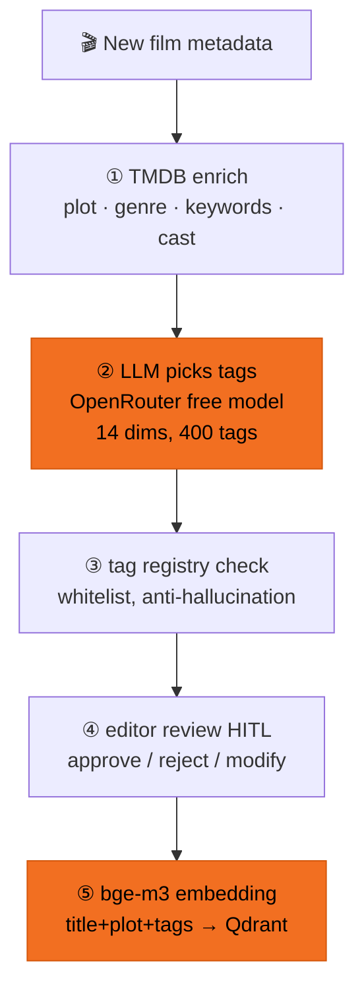

# Auto-tagging — what happens when a film enters the library

A new film arrives; the AI reads its data, picks fitting tags from a 14-dimension / 400-tag taxonomy, an editor signs off, and it becomes a searchable semantic vector.

| Step | What happens | Tech |
|---|---|---|
| ① Gather data | Assemble title and synopsis; fill gaps from an external film database | TMDB API enrich |
| ② AI reads & tags | The AI reads the whole film and picks fitting tags from the 14-dim / 400-tag set | OpenRouter free model (auto-switches among available models; can also run fully local) |
| ③ Anti-hallucination | The AI may only use tags that **exist** in the list — invented ones are dropped | tag registry whitelist |
| ④ Editor gate | Editor approves / rejects / modifies each tag — AI navigates, humans hold taste | Human-in-the-loop audit log |
| ⑤ Become a vector | The whole film (title+plot+tags) is distilled into one "semantic coordinate" for search | bge-m3 embedding → Qdrant |

Any film can be **re-analyzed anytime** (🔄 on its detail page) — rerun the AI, re-enter edit mode. Rejected tags aren't lost; they feed a feedback knowledge base for the AI to digest later (see [Explainable results](/en/explainable)).
