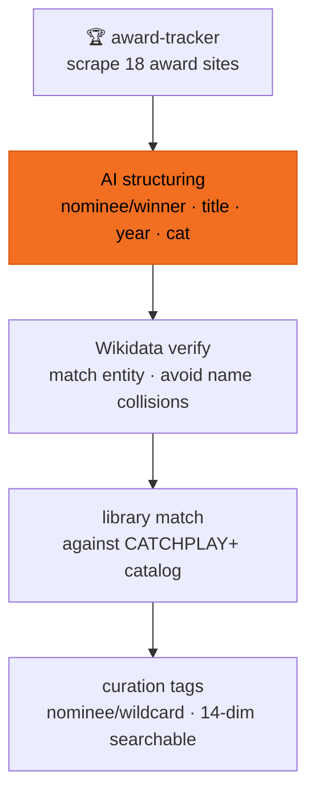

# Award tracking

"Which films did the Oscars nominate this year? Do we have them?" — normally that means manually checking official sites and comparing film by film. This prototype automates it: pull the official nomination lists → AI structures them → match against library tags → verify with Wikidata. Currently loaded: **18 award ceremonies, 3,000+ award records**.

> ℹ️ This page showcases the full system on the real catalogue. The **public repo** ships the ingest path + a neutral source-adapter template (`scripts/adapters/`); the award-site scraping itself is a private adapter.

## Flow

| Step | What happens | Tech |
|---|---|---|
| ① Scrape lists | Pull nomination / winner lists from 18 award sites | award-tracker |
| ② AI structuring | Turn messy web text into title / year / category / nominee-or-winner | LLM |
| ③ Authority check | Match Wikidata entities to avoid tagging the wrong same-name film | Wikidata match |
| ④ Library match | Match lists against the CATCHPLAY+ catalog — flag "which ones we have" | library match |
| ⑤ Curation tags | Award info becomes searchable curation tags (nominee / wildcard) | 14-dim taxonomy |

Once awards are tags, they search alongside every other dimension — a query like "award-winning Korean crime films" hits directly. How "wildcards" are guaranteed into search → [Semantic search](/en/query).

## Demo

18 ceremonies loaded → expand Oscars 2026: nomination / winner lists auto-matched against the CATCHPLAY+ catalog.
