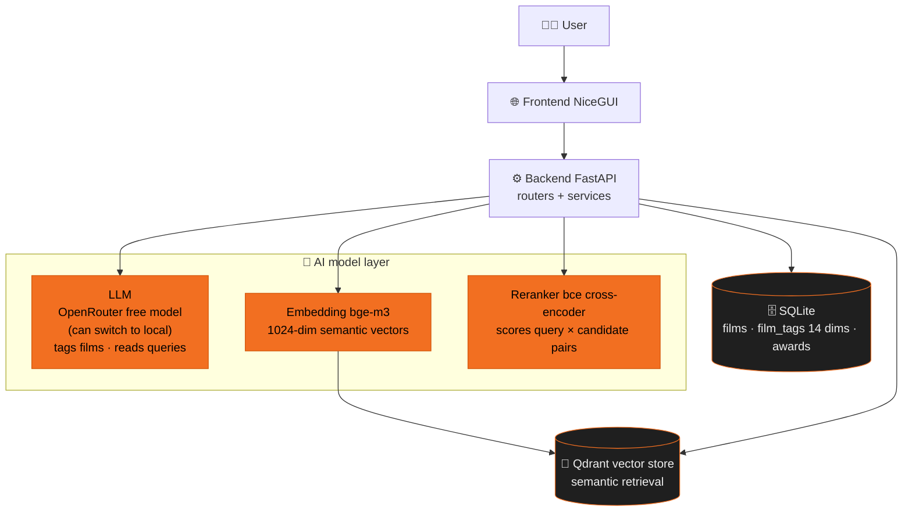

# How the AI Film-Library Brain Works

```text
Five-hundred-plus rigid genre nodes reshaped into a flexible
14-dimension / 400-tag taxonomy — editors find films by describing
what they want in one sentence. The AI says so honestly when nothing
truly matches, and explains itself when something does.
```

Current prototype scale: **600+ films, 7,000+ AI tags, 3,000+ award records (18 award bodies)**.

Dive into the two main pipelines: [Auto-tagging](/en/auto-tag) (a film enters) and [Semantic search](/en/query) (an editor finds one); on trust, see [Explainable results](/en/explainable) and [Honest match](/en/honest).

## The big picture



## Tech stack at a glance

| Role | Tool | Note |
|---|---|---|
| Tagging AI | OpenRouter free model (can switch back to a fully-local LLM) | reads films & queries — defaults to a zero-cost free tier, one switch back to local, never locked to the cloud |
| Semantic understanding | BAAI/bge-m3 | turns films and queries into comparable "semantic coordinates" |
| Reranking AI | maidalun1020/bce-reranker-base_v1 | pairwise query×candidate scoring, fine-grained ranking (Chinese-domain) |
| Literal retrieval | SQLite FTS5 + jieba | Chinese-segmented keyword search, rescues proper nouns |
| Vector store | Qdrant | stores semantic coordinates, millisecond neighbor search |
| Database | SQLite | source of truth for films, tags, awards |
| Award data | award-tracker + Wikidata verify | scrape official nomination lists → AI structure → match library tags |
| Deploy | Docker Compose + Traefik | the whole demo on one VPS |

## Demo

### Search


"Something to watch with mom on Mother's Day" → result cards state matched conditions and how they were found; switch to "Michael Jackson" → no true match in the library, an honest warning + best guesses.

### Auto-tagging


Preview a new film "Oppenheimer": TMDB auto-fills data → AI suggests 11 tags (dry run, not written to the database).

### Awards


18 ceremonies loaded → expand Oscars 2026: nomination / winner lists auto-matched against the CATCHPLAY+ catalog.
