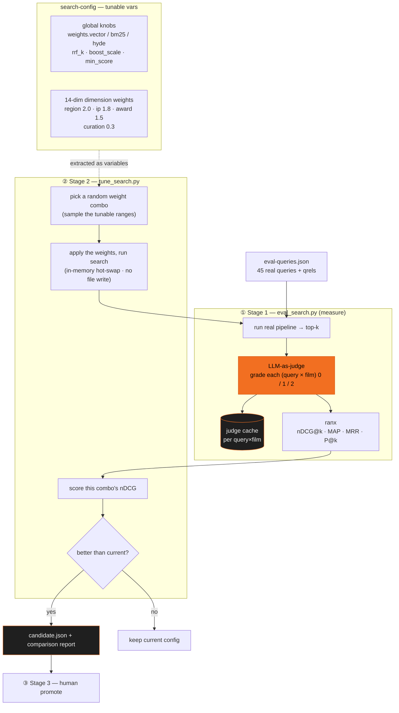

# Eval Iterations v1–v8

No tuning by vibes: an automated harness over 45 real queries (**LLM-as-judge** grades every query × top-5 result), every change gets scored — winners stay, losers roll back.

> ℹ️ These scores (0.93→0.96) were measured on the real catalogue. The **public repo** ships the same eval harness (`scripts/eval_search.py`) + the same 45-query set (`data/eval-queries.json` — query strings, judged at runtime, no gold labels); the headline numbers only reproduce on the real catalogue, so on the bundled mock films the same harness yields different scores.

<EvalChart />

## Architecture: extract config into variables, let eval sweep the weights

The key move is **pulling every search knob out of the code into a single data file, `search-config.json`** (hot-loaded — edit and it takes effect on the next search). Once config is data rather than hard-coded constants, the whole config becomes a "variable vector" the eval can sweep automatically — this is ADR 0004's two-stage self-eval loop.

### Which weight variables get extracted

Once extracted, config splits into two layers, each set differently:

| Layer | Variables | How they're set |
|---|---|---|
| **Global knobs** (SPACE) | `weights.vector/bm25/hyde` (three recall routes), `tag_boost_scale` (overall dimension-boost multiplier), `rrf_k` (fusion constant), `min_display_score` | Stage 2 **random-search sweep** — cartesian product over SPACE, sample N combos |
| **14-dim dimension weights** | region 2.0 · ip 1.8 · award/audience 1.5 · genre 1.0 · theme 0.7 … curation 0.3 | **hand-tuned**, rule: the more definitional/factual (region/IP/award) the higher; the more preferential (theme/emotion) the lower |

Weights boost, not filter: a unified "weighted boost" model with **no hard filtering** — each film carrying a requested tag gets `score += that dimension's weight × tag_boost_scale`, so results are never wiped empty. Dimensions with weight ≥ `inject_weight_threshold` (1.5) count as "strong conditions" and actively **inject** films carrying that tag into the candidate pool (the "wildcard" from the search page), guaranteeing something to rank rather than relying on recall to stumble onto them.

### Why the sweep is affordable: the judge cache

Sweeping N configs looks like N rounds of judging, but **relevance is per (query, film), independent of config** — swapping weights only **reorders** the same films; it never creates a new (query, film) pair. So every judged result hits the `judge cache`, and N configs cost essentially **one** round of judging (the expensive part). That's the precondition that makes "extract config into variables and sweep" viable.

Scoring uses `rerank=False` (CE reranker off): it isolates the contribution of recall + weighted ranking itself, free of reranker noise, and it's fast. Finally it **never overwrites the live config** — the winner only lands in `candidate.json` + a comparison report; a human (Stage 3) decides whether to promote it → echoing the [self-eval loop](/en/self-eval)'s "winners stay, losers roll back" and human-in-the-loop.

## Glossary

| Metric | Plainly | What 1.0 means |
|---|---|---|
| **nDCG@5** | ranking quality of the top 5 — position matters, not just presence | the most relevant exactly on top |
| **MRR** | where the first relevant result lands on average (reciprocal) | rank #1 relevant for every query |
| **P@5** | share of relevant films in the top 5 — order-agnostic hit rate | all five relevant |

## Version overview

| Version | Change | nDCG@5 | MRR | P@5 | Verdict |
|---|---|---|---|---|---|
| v1 | baseline (hybrid + RRF) | 0.9307 | 0.925 | 0.86 | starting point |
| v2 | several gating ideas at once | 0.9255 | 0.9167 | 0.84 | regression — changed too much |
| **v3** | keep only the parser alias | **0.9512** | 0.925 | **0.89** | first big win |
| v4 | + English-domain reranker | 0.9368 | 0.925 | 0.73 | wrong model, precision dropped |
| v5 | step-back always on | 0.9350 | 0.925 | 0.85 | helped vague, hurt specific |
| **v6** | step-back gated conditionally | 0.9623 | **1.000** | 0.84 | perfect MRR ⭐ |
| v7 | English-domain reranker, retried | 0.9368 | 0.9417 | 0.79 | confirmed: it's the model |
| **v8** | Chinese-domain reranker (bce) | **0.9625** | 0.975 | **0.89** | best balance ⭐ |

## Iteration diary

v1 — measure before touching anything

Plant the yardstick: score the plain pipeline as-is — 0.9307. Optimization without a baseline is self-congratulation.

v2 — greed: four ideas at once, regression

Shipped four query-understanding improvements together. -0.005; three queries improved, five worsened, impossible to assign credit. <b class="turn">→ One variable per round, from then on.</b>

v3 — unbundle, keep one: first big win

Kept only the keyword alias table. +0.02 → 0.9512; previously-missed signals all landed. <b class="turn">→ Extending the alias table is pure profit.</b>

v4 — first reranker: faceplant

An English-domain reranker dropped nDCG and P@5 to 0.73. <b class="turn">→ "More AI" doesn't mean better; it can't read a Chinese library.</b>

v5 — query abstraction: helps vague, hurts specific

Step-back vector helped vague queries, injected noise into specific ones. Net loss. <b class="turn">→ Double-edged — the question is when, not whether.</b>

v6 — same trick, plus a switch: perfect MRR ⭐

Abstraction only when the parser finds nothing concrete. 0.9623, rank-1 correct on every query. <b class="turn">→ Gate the smallest possible knob.</b>

v7 — retry English reranker: confirmed it's the model

Added context + position-aware blend — architecturally right, still 0.9368. <b class="turn">→ Architecture patches can't rescue the wrong model.</b>

v8 — Chinese-domain reranker: best balance ⭐

Same API, Chinese-IR-trained bce. nDCG flat, P@5 +0.05, zero eval failures. <b class="turn">→ A reranker's language domain beats its architecture.</b>

## Appendix: a thriftier yardstick — the judge's model and hardware

The grader was **a local model throughout**. Why not cloud? One round is 45 × top-5 = up to 225 gradings; eleven rounds approach 2,500 — free cloud tiers hit limits and fight the product for quota. Local judge: zero marginal cost, reruns anytime, reproducible.

v1–v8 used a larger MoE model (35B-A3B, GPU); later a smaller **8B dense model on an NPU** re-scored — **a different judge is a different yardstick; not comparable with the table above**:

| Round | Scope | nDCG@5 | MRR | Verdict |
|---|---|---|---|---|
| 8B judge @ NPU (subset) | 20 queries | 0.9286 | 0.9417 | small-model + NPU pipeline works |
| 8B judge @ NPU (full) | 45 queries | 0.9233 | 0.9444 | sustained, low-power, off the GPU |
