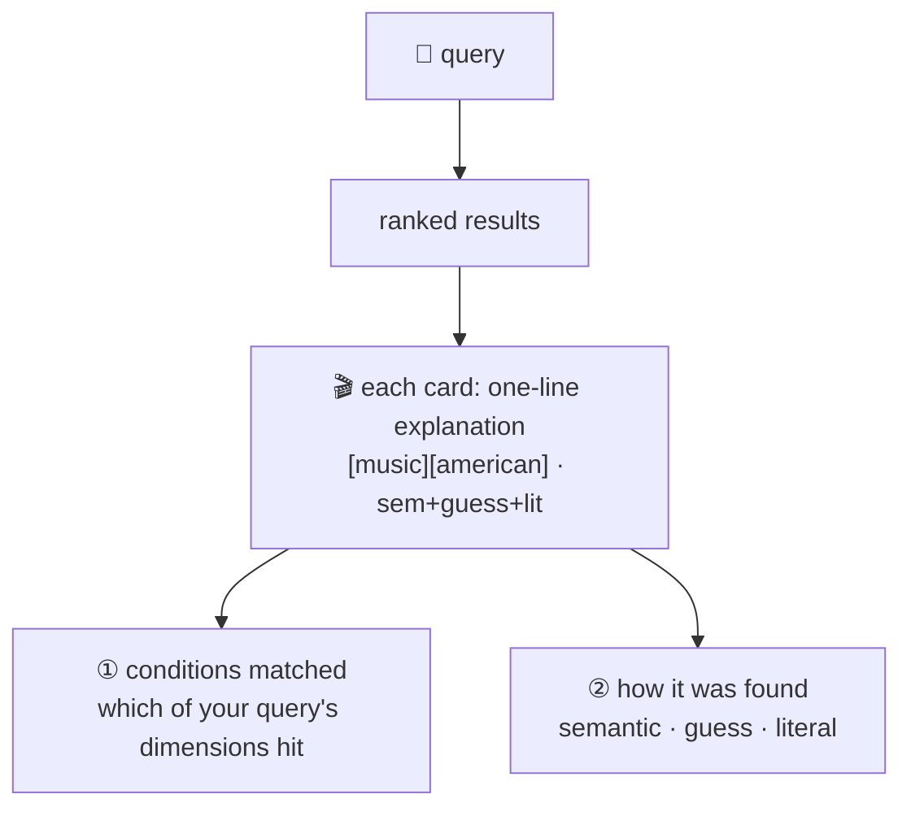

# Explainable results

When the AI finds a film it can't just hand back a result — it has to say **why this one**.
Every result card carries a one-line explanation, so an editor can tell at a glance whether to trust it, and can explain to a colleague why it's being recommended.

## The line on every result card

> `matches [music][american] · semantic+guess+literal`

Read it in two halves:

**First half — which of your conditions it hit:** `[music][american]` are the dimensions from your query this film matched at once (e.g. genre, region). Dimensions it didn't match aren't tacked on.

**Second half — how it was found:** three sources, which can co-occur:

| Mark | Meaning |
|---|---|
| semantic | pulled in by closeness in meaning (even if the wording differs) |
| guess | the AI imagined "what the ideal film looks like," and this one matched that guess |
| literal | your query words appear directly in the title / plot |

## Why this helps editors

- **Decide whether to trust it:** "only via guess, matched no conditions" is a signal to stay skeptical.
- **Explain it out loud:** a concrete basis for "why this film," not "the system said so."
- **Catch problems:** when results look off, this line points straight at which route misfired (see [Debugging log](/en/mj-case)).

---

More: how tags are kept from being invented and how editors review them → [Auto-tagging](/en/auto-tag); how it stays honest when nothing matches → [Honest match](/en/honest).
