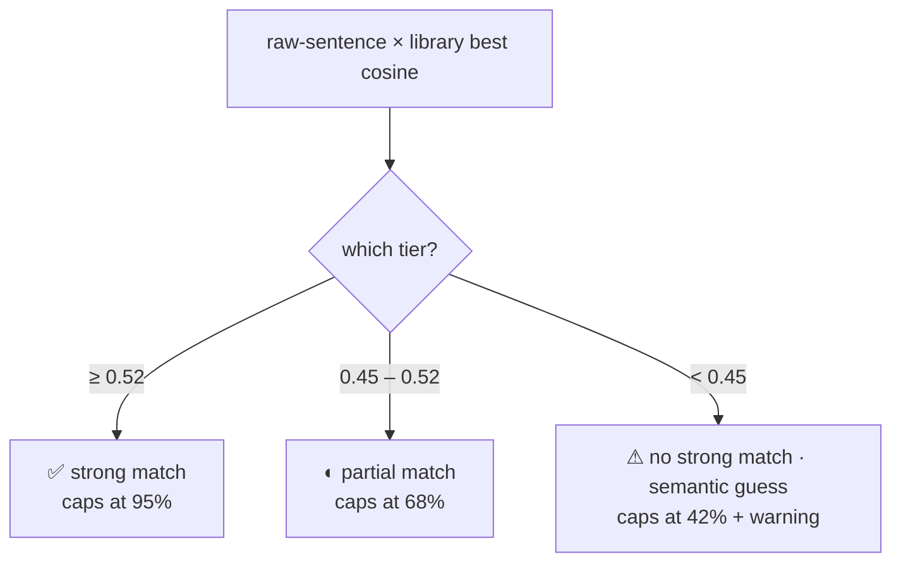
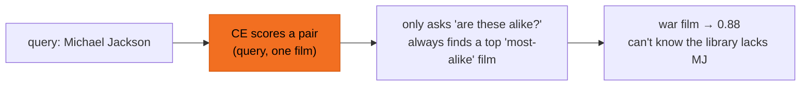
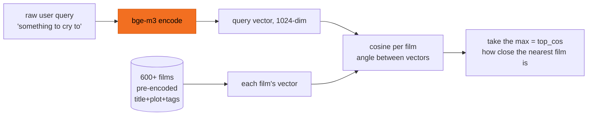
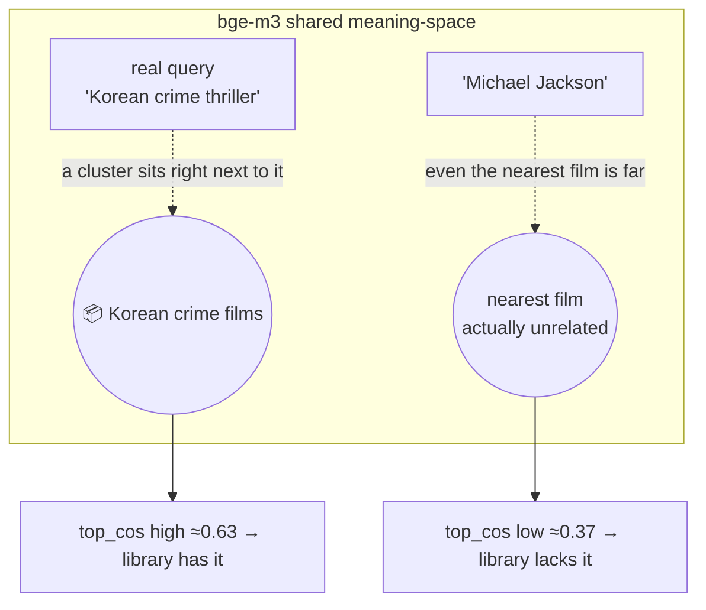

# Honest match

The most dangerous thing a search engine can do isn't failing to find — it's **pretending it found something when it didn't**. This prototype blocks fake perfection at the last gate: it splits every search into **three confidence tiers** by "does the library actually have this," so the top result's % honestly reflects the match instead of always reading 100%.

## The problem: relative scores lie by nature

Internal ranking scores are **relative** (RRF fusion + cross-encoder blends are min-max normalized), so the top of any batch always maps to 1.0. Even when nothing is relevant, #1 still shows **100%** — a perfect score with no way to understand why.

## Why the reranker's score can't be the quality

Tempting: "the cross-encoder scores each pair, just use that as the %." **Measurement says no** — searching "Michael Jackson" (zero relevant films in the library), the CE still gives #1 a **0.88**. The CE rates out-of-domain films just as highly, so it **can't be an absolute quality signal**. We use it only for *ordering*, not the %.

The CE is a **relative pairwise judge**: hand it a film and it rates "is this one relatively alike," always finding a "most-alike" film to score high — it has **no notion of "did anything match overall."**

## The signal that is trustworthy: cosine

Use the user's **raw-sentence** vector against the library for the best cosine — the query and every film are encoded by the **same model into the same coordinate space**, so cosine is their **absolute distance** in meaning-space (not the AI-imagined plot vector — that's written to match the answer and runs high).

Why this is representative for a no-match: a low cosine **isn't "lowest in this batch," it's "even the nearest neighbour is far"** — the query landed in an **empty region** of meaning-space where no film lives. Empty is empty; that low number means something absolute.

So real matches and out-of-domain queries show a clear gap:

| Query | best cosine |
|---|---|
| real queries (45 calibration set) | 0.45 – 0.65 |
| **Michael Jackson (no film)** | **0.37** |
| **quantum mechanics textbook (no film)** | **0.39** |

## Three confidence tiers

| Tier | cosine | Banner | % ceiling |
|---|---|---|---|
| high | ≥ 0.52 | ✅ strong match | 95% |
| mid | 0.45 – 0.52 | ◐ partial match | 68% |
| low | < 0.45 | ⚠ no strong match · semantic guess | 42% + warning |

- **The ceiling carries the honest signal**: #1's % reflects "does the library have this" (95 / 68 / 42), no longer always 95%.
- **Position within a tier = CE ordering** (the absolute value is meaningless); min-maxed over the **full candidate pool**, so a given film's % is stable no matter how many results you show.
- Honest at the edges: cosine catches gross out-of-domain (MJ, quantum physics), but soft out-of-domain ("how to file taxes," cosine 0.47) overlaps the weakest real queries and can't be told apart → it lands in *mid* (caps 68%) rather than faking a strong match.

## Where this rule came from

From a real incident: searching "Michael Jackson," none of the 600+ films were relevant, yet #1 was a war-crime drama labeled 100%. The full debugging record — symptom, root cause, measurement calibration, fix → [Debugging log](/en/mj-case).
