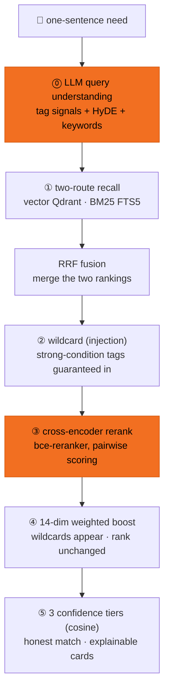

# Semantic search — after an editor types one sentence

The editor types a sentence; the AI reads the intent, recalls candidates two ways, reranks, and returns explainable results. It works like a talent show:

| Step | What happens | Tech |
|---|---|---|
| ⓪ Read the need | The AI parses your sentence: pulls conditions (region/award/mood…), imagines what the best-fit film looks like | LLM query understanding: taxonomy tag signals + HyDE plot guess + keywords |
| ① Recall | Two broad sweeps for candidates: **semantic** (close in meaning) + **literal** (word hits) | vector recall (bge-m3+Qdrant) + BM25 (FTS5+jieba) |
| ② Wildcard | Films not recalled but matching strong conditions (region/award…) get an invite — guaranteed to appear | strong-condition tag injection |
| ③ Judge rerank | The model scores each candidate against your query pairwise and reorders | cross-encoder (bce-reranker) |
| ④ Condition boost | Films matching your conditions move up; **wildcards only appear, rank stays** | 14-dim weighted boost (no hard filter, never empty) |
| ⑤ Honest match | Three tiers by raw-sentence × library cosine: strong caps at 95% / partial at 68% / no-match at 42% + warning. #1's % reflects "is it really there," **never a fake 100%** | 3 confidence tiers (cosine; CE only orders, see [Honest match](/en/honest)) |

Every result card explains "why this one": `matches [music][american] · semantic+guess+literal` (which conditions, and how it was found — see [Explainable results](/en/explainable)).

→ Want to see real output? Click a preset query on the [Search replay](/en/search).
