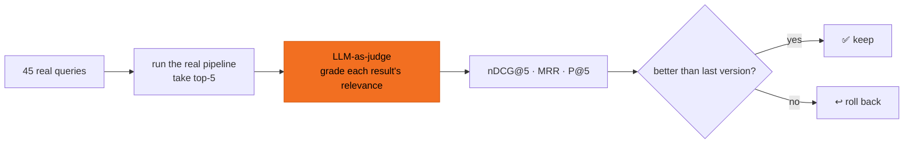

# Self-eval loop

The scariest thing about tuning search: change one parameter, some queries get better while others quietly get worse — and the eye can't tell. This prototype gives itself a yardstick — every change is auto-scored, **winners stay, losers roll back**, no vibes.

## How it works

- **Query set**: 45 real editor queries (e.g. "Korean crime thriller," "cozy Mother's Day film").
- **Judge**: an LLM-as-judge grades each query's top-5 results for relevance.
- **Metrics**: nDCG@5 (ranking quality), MRR (is #1 right), P@5 (top-5 hit rate).
- **Discipline**: one variable per round — so you can tell whose win or whose fault it is.

## Why this matters to you

It means the library's search quality is **backed by objective numbers**, not just lucky on demo day. Across eight iterations, top-5 hit quality rose from nDCG@5 0.93 → 0.96, every step with scoring evidence:

| | nDCG@5 | Note |
|---|---|---|
| v1 start | 0.9307 | plain pipeline baseline |
| v8 best | **0.9625** | Chinese-domain reranker, best balance |

The full v1–v8 diary — "what each version was thinking, and why it rolled back" → [Eval](/en/eval).
