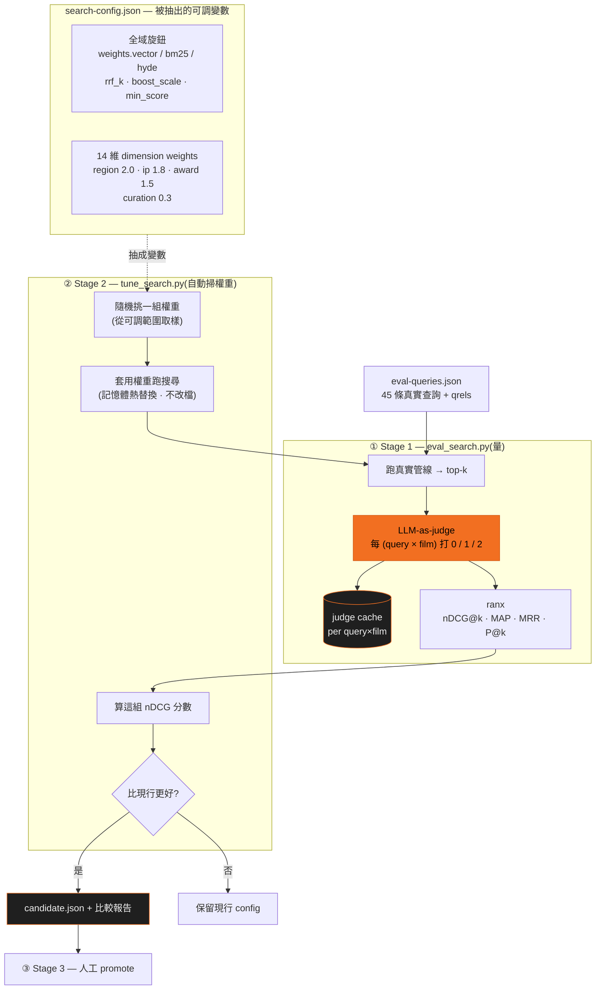

# 評測迭代 v1–v8

不憑感覺調參:45 條真實查詢的自動評測 harness(**LLM-as-judge** 對每個 query × top-5 結果打相關度),每輪改動都跑分 — 贏的留、輸的回滾。

> ℹ️ 這組分數(0.93→0.96)是跑在真實目錄上測的。**公開 repo** 出一樣的 eval harness(`scripts/eval_search.py`)+ 同一組 45-query set(`data/eval-queries.json`,只放查詢字串、由 judge 即時評、無 gold label);但分數本身要在真實目錄才復現,跑在內附 mock 片庫上會是不同數字。

<EvalChart />

## 架構:把 config 抽成變數,讓評測自己掃權重

關鍵一招是**把搜尋的所有旋鈕從程式碼裡抽出來,變成一份純資料 `search-config.json`**
(搜尋熱載,改檔即生效)。一旦 config 是資料而不是寫死的常數,整份 config 就能被當成
一個「變數向量」,讓評測自動 sweep — 這就是 ADR 0004 的兩段式自評閉環。

### 抽出的是哪些變數權重

config 抽出後分兩層,各自用不同方式定權重:

| 層 | 變數 | 怎麼定 |
|---|---|---|
| **全域旋鈕**(SPACE) | `weights.vector/bm25/hyde`(三路召回權重)、`tag_boost_scale`(維度 boost 總倍率)、`rrf_k`(融合常數)、`min_display_score` | Stage 2 **random-search 自動掃** — 對 SPACE 做笛卡兒積、隨機取樣 N 組 |
| **14 維 dimension weights** | region 2.0 · ip 1.8 · award/audience 1.5 · genre 1.0 · theme 0.7 … curation 0.3 | **手調**,判準:越定義性/事實性(地區/IP/得獎)權重越高、偏好性(主題/情緒)越低 |

權重不是篩子是加分:統一「加權 boost」模型,**沒有任何硬性過濾** —— 每部片帶到查詢要求的
tag,分數 `+= 該維 weight × tag_boost_scale`,所以永不清空結果。weight ≥ `inject_weight_threshold`
(1.5)的維度算「強條件」,會主動把帶該 tag 的片**注入**候選池(就是搜尋頁說的「外卡」),
確保有結果可排,而不是只靠召回撞到。

### 為什麼掃得起:judge cache

掃 N 組 config 看似要判 N 次,但**相關度是 per (query, film),跟 config 無關** ——
換一組權重只是把同一批片**重新排序**,並沒有產生新的 (query, film) 配對。所以判過的結果
全部命中 `judge cache`,N 組 config 幾乎只付**一次** judge 成本(最貴的那筆)。
這就是「把 config 抽成變數來掃」能成立的前提。

評分時用 `rerank=False`(關掉 CE 精排):排除精排噪音、純看召回 + 權重排序本身的貢獻,
而且快。最後**不覆寫線上 config** — 贏家只寫進 `candidate.json` + 比較報告,
由人(Stage 3)決定要不要 promote → 呼應[自評閉環](/self-eval)的「贏留、輸回滾」與人在迴圈。

## 名詞解釋

| 指標 | 白話 | 1.0 的意思 |
|---|---|---|
| **nDCG@5** | 前 5 名的「排序品質」— 對的片排得越前面分數越高,排對位置比只是有出現更重要 | 理想排序:最相關的剛好都排最前 |
| **MRR** | 第一個相關結果平均出現在第幾名(取倒數)— 衡量「第一名直接就對」的能力 | 每一條查詢的第 1 名都相關 |
| **P@5** | 前 5 名裡相關影片的比例 — 不管順序,只看命中率 | 前 5 名全部相關 |

## 各版本一覽

| 版本 | 改了什麼 | nDCG@5 | MRR | P@5 | 結論 |
|---|---|---|---|---|---|
| v1 | baseline(hybrid + RRF) | 0.9307 | 0.925 | 0.86 | 起點 |
| v2 | 多項 gating 一起上 | 0.9255 | 0.9167 | 0.84 | 回退 — 一次改太多 |
| **v3** | 只留 parser alias | **0.9512** | 0.925 | **0.89** | 第一個大贏 |
| v4 | + 英文域 reranker | 0.9368 | 0.925 | 0.73 | 選錯模型,精確度掉 |
| v5 | step-back 全開 | 0.9350 | 0.925 | 0.85 | 幫模糊查詢、傷具體查詢 |
| **v6** | step-back 改條件觸發 | 0.9623 | **1.000** | 0.84 | MRR 滿分 ⭐ |
| v7 | 再試英文域 reranker | 0.9368 | 0.9417 | 0.79 | 確認是模型問題 |
| **v8** | 換中文域 reranker(bce) | **0.9625** | 0.975 | **0.89** | 均衡最佳 ⭐ |

## 迭代手記 — 每一版在想什麼

v1 — 先量再動

動手調參前先立尺:雙路召回 + RRF + 加權 boost 的素管線直接跑分,0.9307。沒有 baseline 的優化都是自我感覺良好。

v2 — 貪心:四個想法一起上,整體回退

當時覺得 query 理解有四個明顯可改(關鍵字對照表、展開降權、維度過濾、跳過展開),都對就全上。結果 -0.005:3 條變好、5 條變差,而且互相打架,根本分不出誰的功勞誰的鍋。 <b class="turn">→ 轉折:從此一輪只動一個變因。這個紀律比任何單一技巧值錢。</b>

v3 — 拆開重來,只留一個:第一個大贏

把 v2 四件事拆開,只留「關鍵字對照表」(英文別名 + 50 個中文類型詞 + 得獎詞)。+0.02 → 0.9512,「韓國犯罪驚悚」「得獎」「監獄」這些之前完全漏接的訊號全接住了。 <b class="turn">→ 學到:擴充對照表是純賺,沒有副作用,值得一直補。</b>

v4 — 第一次上精排模型:翻車

直覺上「多一層精排一定更準」。掛上英文域訓練的 reranker,反而 -0.014,前五命中率掉到 0.73。 <b class="turn">→ 學到:它是在英文資料上學的「相關」,看不懂中文片庫;「多一層 AI」不保證更好。</b>

v5 — 抽象化查詢:幫了模糊的,傷了具體的

讓 LLM 把查詢「抽象化」(「被仙人跳分手療傷」→「失戀療癒」)再多召回一路。模糊查詢 +1,但 6 條具體查詢(「香港警匪片」「監獄」…)被拉進雜訊,淨輸。 <b class="turn">→ 轉折:這招是雙面刃,問題不是「要不要用」,是「什麼時候用」。</b>

v6 — 同一招,加個開關:MRR 滿分 ⭐

只在「查詢裡抓不到任何具體條件」時才啟用抽象化。0.9623,每一條查詢的第一名都對(MRR 1.0)。 <b class="turn">→ 學到:v2 教訓真正的形狀 — gating 不是不能做,是要鎖在最小的那顆旋鈕上。</b>

v7 — 不死心再試英文 reranker:確認是模型的鍋

給它補上年份/地區/卡司資訊、改成位置感知混分 — 架構上全對,分數還是 0.9368。 <b class="turn">→ 學到:架構修補救不了選錯模型。兩輪失敗把問題定位釘死了。</b>

v8 — 換中文域 reranker:均衡最佳 ⭐

同一個 API 介面,換成中文 IR 訓練的 bce 模型。nDCG 持平 0.9625,但前五命中率 +0.05、評測零失敗 — 精排終於開始賺錢。 <b class="turn">→ 學到:reranker 的語言域比架構重要;對的模型讓 v4/v7 全部的架構工作瞬間生效。</b>

## 幾個有代表性的教訓

- **一次只改一件事** — v2 把四個想法一起上,整體回退;v3 拆開只留一個,+0.02。
- **step-back 抽象查詢向量是雙面刃** — 模糊查詢(「被仙人跳分手療傷」)受益,具體查詢(「香港警匪片」)被拉進雜訊;v6 改成「parser 抓不到具體條件才啟用」後 MRR 1.0。
- **reranker 的語言域比架構重要** — 同 API 介面,英文域模型連兩輪扣分,換中文域訓練的 bce 立刻 nDCG +0.026、P@5 +0.10。

## 附註:換一把更省電的尺 — judge 的模型與硬體

評測的打分者(LLM judge)**全程都是本地模型**。為什麼不用雲端?一輪評測是 45 條查詢 × top-5 = 最多 225 次打分,11 輪迭代下來逼近 2,500 次 — 走雲端免費額度馬上撞限流,還會跟產品本身的 LLM 配額互搶;本地 judge 零邊際成本、隨時重跑、結果可重現(同模型同 prompt,分數不會因服務端改版而漂)。

v1–v8 用較大的 MoE 模型(35B-A3B,跑在 GPU);後來換成小一號的 **8B dense 模型跑在 NPU** 重評 —**模型不同 = 尺不同,分數不能跟上面直接比**,所以分開列:

| 輪次 | 範圍 | nDCG@5 | MRR | 結論 |
|---|---|---|---|---|
| 8B judge @ NPU(子集) | 20 條查詢 | 0.9286 | 0.9417 | 小模型 + NPU 評測管線跑通 |
| 8B judge @ NPU(全量) | 45 條查詢 | 0.9233 | 0.9444 | 持續穩定 — 評測可低功耗長跑,不佔 GPU |
