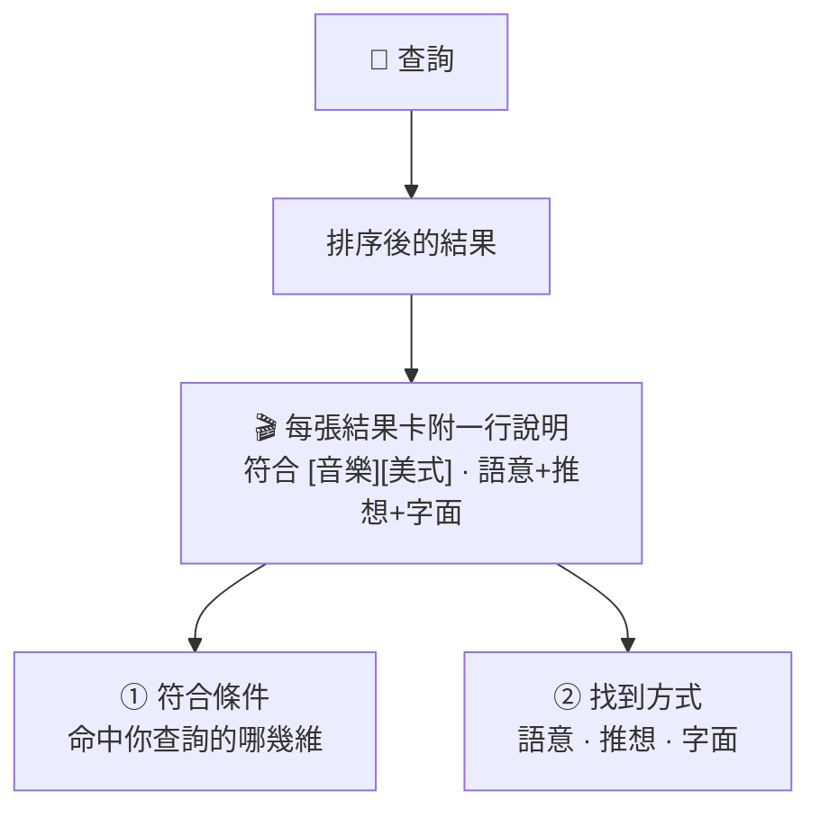

# 可解釋結果

AI 找到片時,不能只丟一個結果就算了 —— 要講得出**為什麼是這部片**。
這個原型的每張結果卡都帶一行「說明」,編輯一眼就知道該不該信,也能跟同事解釋為什麼推這部。

## 結果卡上的那行字

> `符合 [音樂][美式] · 語意+推想+字面`

拆成兩半看:

**前半 — 對上你哪些條件**:`[音樂][美式]` 是這部片同時命中了你查詢裡的哪幾個維度
(例如曲風、地區)。沒對上的維度不會硬掛上去。

**後半 — 它是怎麼被找到的**:三種來源,可能同時出現:

| 標記 | 意思 |
|---|---|
| 語意 | 意思相近被撈到(就算用字不一樣) |
| 推想 | AI 先想像「最符合的片長什麼樣」,這部命中了那個想像 |
| 字面 | 查詢字詞直接出現在片名 / 劇情裡 |

## 為什麼這對編輯有用

- **判斷該不該信**:看到「只靠推想、沒對到任何條件」,就知道要存疑。
- **講得出口**:跟主管解釋「為什麼推這部」時有具體依據,不是「系統說的」。
- **抓問題**:結果怪怪的時候,這行字直接指出是哪一路出包(見 [除錯實錄](/mj-case))。

---

延伸:標籤怎麼防 AI 亂編、編輯怎麼把關 → [自動標籤](/auto-tag);
查不到時怎麼誠實處理 → [誠實匹配](/honest)。
