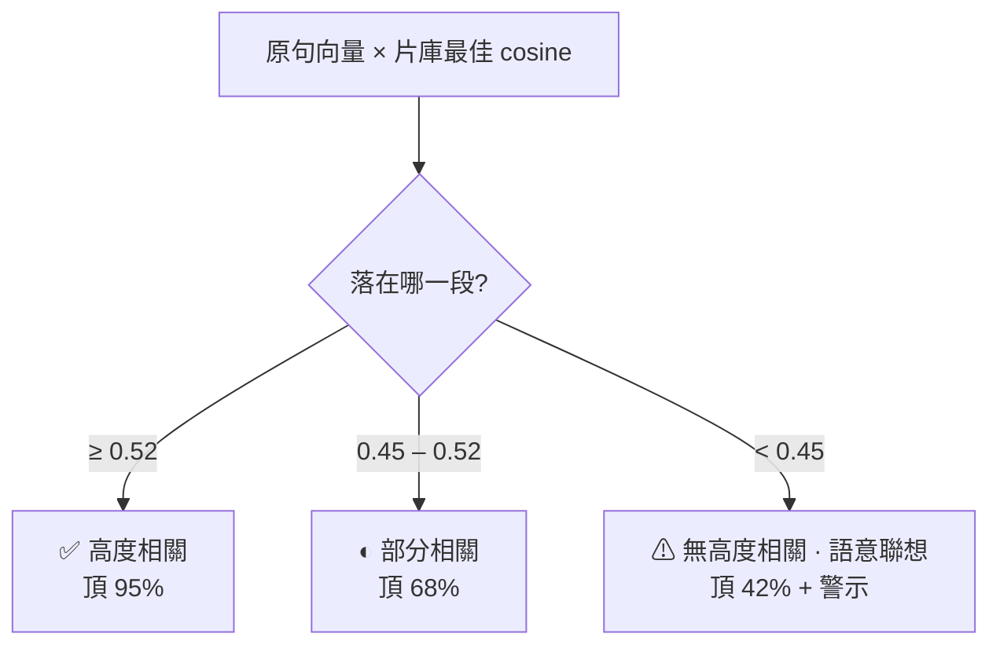
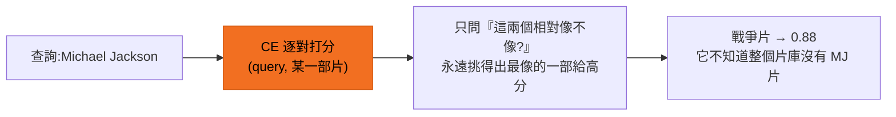
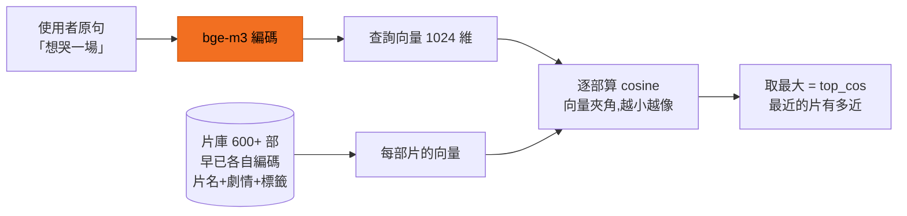
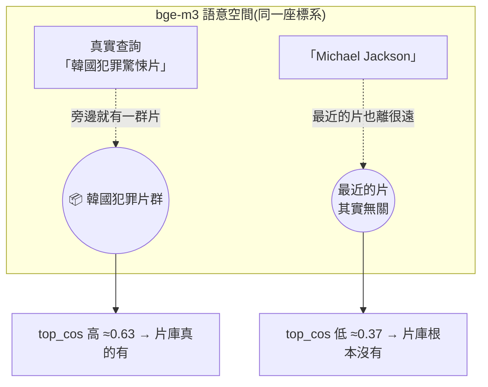

# 誠實匹配

搜尋引擎最危險的不是找不到,是**找不到卻假裝找到了**。這個原型在最後一關擋住假滿分:
依「片庫到底有沒有這片」把搜尋分成**三段信心**,第一名的 % 老實反映匹配程度,而不是永遠 100%。

## 問題:相對分數天生會說謊

排序內部分數是**相對值**(RRF 融合分、cross-encoder 混分都經 min-max),
所以「這批裡的第一名」永遠被映成 1.0。就算整批都不相關,第一名照樣顯示 **100%** ——
使用者看到滿分,卻完全無從理解為什麼是它。

## 為什麼不能用 AI 精排分數當品質

直覺會想:「cross-encoder 逐對打分,拿它的分當 % 不就好了?」**實測打臉**:
搜「Michael Jackson」(片庫一部相關都沒有),CE 還是給第一名 **0.88** 高分 ——
CE 對離題片照樣給高分,**不能當絕對品質**。所以 CE 只拿來決定**排序**,不決定 %。

CE 是**相對配對判斷**:給它一部片就評「這部相對像不像」,總找得到「最像的一部」打高分,
**沒有「整體有沒有命中」的概念**。

## 真正可信的訊號:cosine

改用使用者**原句**向量對片庫算最佳 cosine —— 查詢和每部片用**同一個模型編進同一個座標系**,
cosine 就是兩者在意義空間裡的**絕對距離**(不能用 AI 腦補的劇情向量,那照著答案寫、天生偏高)。

為什麼這對「無命中」有代表性:cosine 低**不是「相對這批最低」,是「最近的鄰居也很遠」** ——
查詢落在語意空間裡**沒有片的空區**。空區就是空區,這個低分有絕對意義。

真命中與離題因此有清楚落差:

| 查詢 | 最佳 cosine |
|---|---|
| 真實查詢(45 條校準) | 0.45 – 0.65 |
| **Michael Jackson(無片)** | **0.37** |
| **量子力學教科書(無片)** | **0.39** |

## 三段信心帶

| 段 | cosine | 橫幅 | 顯示 % 上限 |
|---|---|---|---|
| 高 | ≥ 0.52 | ✅ 高度相關 | 95% |
| 中 | 0.45 – 0.52 | ◐ 部分相關 | 68% |
| 低 | < 0.45 | ⚠ 無高度相關 · 語意聯想 | 42% + 警示 |

- **天花板帶誠實訊號**:第一名的 % 反映「片庫到底有沒有這片」(95 / 68 / 42),不再每查詢都 95%。
- **帶內位置 = AI 排序**(絕對值不具意義);對**整個候選池**算 min-max,所以同一部片換顯示筆數,分數不變。
- 邊界誠實:cosine 抓得出重度離題(MJ、量子),但軟離題(查「怎麼報稅」cosine 0.47)跟最弱的真實查詢重疊、分不開 → 歸「中」頂 68%,而非假裝高度相關。

## 這條規則怎麼來的

來自一次真實事故:搜「Michael Jackson」,片庫 600+ 部全無相關,第一名卻是一部戰爭犯罪片、
標 100%。從現象、根因、量測校準到修法的完整 debugging 全記錄 → [除錯實錄](/mj-case)。
