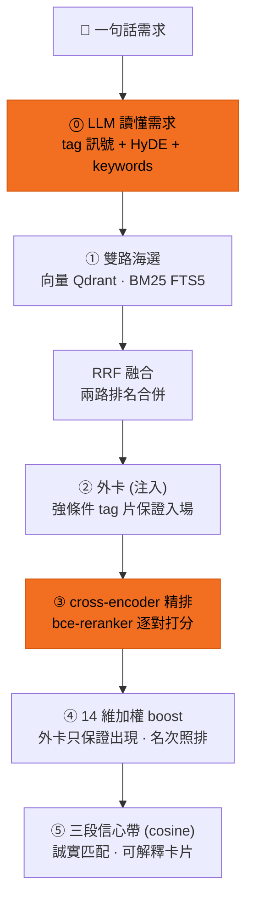

# 語意搜尋 — 編輯輸入一句話之後

編輯打一句話,AI 讀懂意圖、兩路海選、精排,給出可解釋的結果。流程像選秀:

| 步驟 | 說明 | 技術 |
|---|---|---|
| ⓪ 讀懂需求 | AI 先理解你這句話:抓出條件(地區/得獎/情緒…)、想像「最符合的電影長什麼樣」 | LLM query 理解:taxonomy tag 訊號 + HyDE 推想劇情 + 關鍵字 |
| ① 海選 | 兩路大範圍撈候選:**語意**(意思相近)+ **字面**(字句命中) | 向量召回(bge-m3+Qdrant)+ BM25(FTS5+jieba) |
| ② 外卡 | 沒被海選撈到、但符合強條件(地區/得獎…)的片獲邀入場,保證出現 | 強條件 tag 注入候選池 |
| ③ 評審精排 | 模型把每部候選跟你的查詢逐一比對打分,重新排序 | cross-encoder(bce-reranker) |
| ④ 條件加分 | 帶到你指定條件的片往前排;**外卡只保證出現,名次照排** | 14 維加權 boost(無硬篩,永不空結果) |
| ⑤ 誠實匹配 | 依「原句向量對片庫最佳 cosine」分三段:高度相關頂 95% / 部分相關頂 68% / 無高度相關頂 42% + 警示。第一名的 % 反映「有沒有這片」,**永遠沒有假滿分** | 三段信心帶(cosine;CE 只做排序,見[誠實匹配](/honest)) |

每張結果卡都講得出「為什麼是它」:`符合 [音樂][美式] · 語意+推想+字面`(對上哪些條件 + 怎麼找到的,見[可解釋結果](/explainable))。

→ 想直接看真實輸出?到[搜尋回放](/search)點預設查詢。
