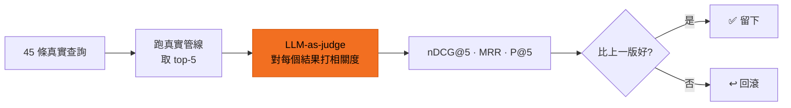

# 自評閉環

調搜尋最怕的是:改了一個參數,某些查詢變好、另一些悄悄變爛,人眼根本看不出來。
這個原型給自己裝了一把尺 —— 每次調動都自動跑分,**贏的留、輸的回滾**,不憑感覺。

## 怎麼運作

- **題庫**:45 條真實編輯查詢(含「韓國犯罪驚悚」「母親節溫馨片」這類)。
- **打分者**:LLM-as-judge,對每條查詢的 top-5 結果逐一打相關度。
- **指標**:nDCG@5(排序品質)、MRR(第一名準不準)、P@5(前五命中率)。
- **紀律**:一輪只改一個變因 — 才分得出誰的功勞、誰的鍋。

## 為什麼這對你重要

這代表片庫的搜尋品質**有客觀數字背書**,不是 demo 當下剛好順。八輪迭代下來,
前五名命中品質從 nDCG@5 0.93 → 0.96,每一步都有跑分證據:

| | nDCG@5 | 說明 |
|---|---|---|
| v1 起點 | 0.9307 | 素管線 baseline |
| v8 最佳 | **0.9625** | 換中文域 reranker,均衡最佳 |

完整 v1–v8「每一版在想什麼、為什麼回滾」的迭代手記 → [評測迭代](/eval)。
